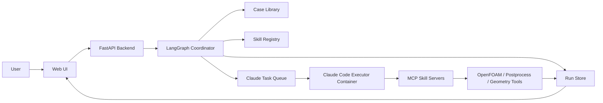

# 基于 Claude Code 执行层的潜艇计算智能体技术方案

- 文档状态：Draft v1
- 日期：2026-03-19
- 文档类型：技术方案
- 主要用途：梳理项目技术路线
- 当前范围：第一版 Demo

## 1. 项目目标与边界

### 1.1 项目目标

本项目的目标不是做一个泛化的“聊天型科研助手”，而是做一个**面向潜艇计算任务的案例驱动型智能体系统**。系统需要能够在用户给出任务需求和几何文件后，完成案例检索、流程建议、人工确认、分步调用 skill、执行求解、展示中间产物并生成详细报告。

用更直接的话说，这个项目要解决的不是“模型会不会回答潜艇 CFD 问题”，而是“能不能把潜艇计算相关的专业能力组织成一条可执行、可解释、可复盘的工作流”。

对于第一版 demo，这个目标至少包含以下几个可验证结果：

- 用户可以通过 Web 页面提交任务和上传几何文件。
- 系统能够识别任务目标，并从案例库中检索相似案例。
- 系统能够在计算前给出一条建议流程，并要求用户人工确认。
- 系统能够调用已有 skill 和开源求解器跑通基础案例。
- 系统能够清晰展示中间文件、日志、结果图表和最终报告。

### 1.2 为什么第一版必须聚焦“案例驱动 + 流程透明”

如果只从模型能力出发，第一版完全可以被做成一个“用户上传文件，系统给出结果图”的黑盒工具。但这不符合你当前真正想验证的东西。

你现在想梳理的技术路线，核心并不只是“能算”，而是：

- 为什么系统选这个案例
- 为什么系统推荐这条流程
- 哪一步调用了什么 skill
- 中间文件和计算证据在哪里
- 最终结果如何和参考案例建立联系

这决定了第一版不能把重点放在 UI 华丽或求解器覆盖面上，而要优先验证“案例驱动的工作流体系”。

也正因如此，这份方案把“流程透明”和“中间产物可见”放在非常高的位置。第一版就应该让用户清楚看到：系统不是突然给答案，而是先理解任务、再找案例、再组织流程、再执行计算、最后形成文档。

### 1.3 第一版输入边界

根据当前讨论，第一版输入边界已经比较明确。

首先，用户入口是 **Web 页面**。这意味着系统要天然支持文件上传、状态展示和结果浏览，而不是只面向终端或开发者环境。

其次，用户上传文件以几何文件为主，当前优先考虑：

- `x_t`
- `STL`
- 以及其他后续可扩展的合适几何文件格式

这里有一个重要的边界判断：第一版不需要支持所有 CAD/网格格式，也不需要在第一天就做到完美几何修复。更现实的目标是支持少数高价值格式，并在几何检查阶段明确告诉用户当前文件是否适合进入后续流程。

再次，用户输入不要求完整专业化。也就是说，第一版默认用户可能只会给出：

- 一个几何文件
- 一个简单任务目标
- 少量工况说明

系统需要承担相当一部分“把不完整输入转换成结构化任务”的工作。

### 1.4 第一版输出边界

第一版输出不应只有最终结果图，而应形成一个完整结果包。

从当前目标看，第一版“基本的计算结果都要有”，这意味着结果层至少应包括：

- 表面压力分布相关结果
- 总阻力或阻力系数
- 基础流场可视化结果
- 必要的表格或数值摘要
- 详细报告

此外，你也明确要求中间文件和计算结果要对用户清晰可见。因此，系统输出还必须包含：

- 输入文件和运行参数记录
- 案例检索结果和建议流程
- 运行日志
- 中间生成文件清单
- 后处理图片和结构化结果文件

从产品定义角度看，这个输出集合非常重要，因为它把系统定位成“可追踪的工程工作流系统”，而不是“只给最终答案的黑盒算例助手”。

### 1.5 第一版案例范围边界

第一版虽然要体现潜艇计算方向，但仍然需要明显收敛，不适合一开始就追求大而全。

基于当前讨论，第一版建议优先围绕以下 benchmark/案例家族建立案例库：

- `DARPA SUBOFF`
- `Joubert BB2`
- `Type 209` 或一个更工程化的代表艇型

这三类的组合有明显好处。

`DARPA SUBOFF` 可以作为主 benchmark 家族，用来支撑阻力、压力分布、尾流和更多扩展方向。

`Joubert BB2` 可以作为第二几何家族，帮助系统避免把所有推荐都压在同一 benchmark 上。

`Type 209` 或类似工程化艇型则更贴近“用户上传实际几何后系统如何解释和映射”的故事线。

这个范围已经足够支撑第一版 demo，又不会把案例库建设规模推得过大。

### 1.6 第一版计算能力边界

第一版的重点不是覆盖所有潜艇水动力问题，而是围绕少数高价值参数把闭环跑通。

建议优先覆盖以下结果类型：

- 表面压力分布
- 总阻力和阻力系数
- 基础流场结果
- 可能的尾流截面或典型后处理图

这些结果有三个优势。

第一，它们是典型潜艇外流场分析里最基础、最有解释价值的结果。

第二，它们和已公开 benchmark、论文案例、软件教程之间有较强映射关系，便于建立案例库和结果对比机制。

第三，它们很适合在 demo 中展示“从几何到结果”的价值链条。

需要明确的是，第一版不应承诺以下能力：

- 全部操纵性参数自动化建模
- 全部自由液面和自航工况
- 大规模高保真仿真体系
- 全自动处理任意几何并给出工业级可靠结果

这些方向都可以保留为第二阶段或第三阶段目标，但不应成为第一版成败判断标准。

### 1.7 第一版系统边界

这一版系统在角色定位上也需要收口。

系统不是：

- 通用聊天助手
- 通用 CAD/CFD 平台替代品
- 全自动科研发现系统
- 面向所有领域的 agent 平台

系统是：

- 一个面向潜艇计算任务的专用工作流系统
- 一个以案例库驱动的流程推荐系统
- 一个以 `Claude Code` 为执行层、以 `LangGraph` 为协调层的智能体应用
- 一个强调中间过程、结果证据和最终报告的科研 demo 系统

这个边界划分非常重要。它能防止后续需求在第一版阶段无限膨胀。

### 1.8 本节结论

第一版项目目标可以概括为：

**围绕潜艇典型计算案例，做一个“输入任务与几何 -> 检索案例 -> 建议流程 -> 用户确认 -> 调用 skill 执行 -> 展示全过程产物 -> 输出详细报告”的 Web 智能体系统。**

第一版的价值，不在于覆盖所有潜艇计算问题，而在于证明这条案例驱动、流程透明、容器化管理、可复盘的技术路线是成立的。

## 2. 核心技术路线与总体架构

### 2.1 先明确这个项目的技术问题是什么

在决定技术路线之前，先要把问题描述得足够准确。这个项目表面上看是“让智能体调用 OpenFOAM 做潜艇计算”，但如果只这样理解，最后很容易把系统做成一个会调用命令的聊天机器人，而不是一个真正可用的科研工作流系统。

从当前目标来看，系统至少要同时满足以下五类需求：

第一，系统要能理解用户任务，而用户输入未必是完整、规范的。用户可能只上传一个 `STL` 或 `x_t` 几何文件，然后说“帮我算这个工况下的压力分布和阻力”，但并不会一开始就把网格策略、雷诺数、边界条件、参考案例、后处理指标都讲清楚。

第二，系统不能直接“看到什么就开始算”。潜艇计算成本高、时间长、输入敏感，第一版虽然是 demo，但仍然需要遵守工程流程：先找相似案例，再给出建议流程和默认假设，再让用户确认，再进入求解。这意味着系统从第一天开始就不是单轮对话产品，而是带人工确认节点的多阶段流程系统。

第三，系统执行的不是纯文本任务，而是带大量文件产物的任务。一个真实运行过程里会出现上传几何、转换格式、网格、求解器配置、日志、流场结果、截图、表格、最终报告等多类文件。如果不从架构层面把这些文件当成一等对象管理，后面很快就会陷入“会算，但算完找不到过程证据”的状态。

第四，这个系统必须以案例为中心，而不是以 prompt 为中心。你已经明确提出案例要来自潜艇计算相关论文和软件案例，而且不仅要存参考文献，还要存“详细流程”。这意味着系统的核心知识单元不是一句提示词，而是一个结构化案例对象，包括几何家族、工况、推荐流程、求解器配置、参考结果和适用 skill。

第五，系统需要兼顾灵活性和确定性。潜艇计算任务天然具有“半结构化”特点：案例检索、流程选择、日志阅读、报告生成需要智能能力；而文件管理、结果归档、大文件处理、求解器运行、权限边界这些部分又必须确定可控。换句话说，系统既不能完全靠规则，也不能完全交给模型自由发挥。

正是因为这五类需求同时存在，才决定了第一版不能简单选一种现成 agent 外壳直接套用，而需要把系统拆成几个边界清晰的层。

### 2.2 候选架构的比较过程

围绕“Claude Code 作为执行层”这一前提，第一版其实有三种典型架构思路。

#### 方案 A：让 Claude Code 直接主导整个系统

这个方案的想法最直接：Web 层收到用户请求后，基本只负责转发，把任务和文件交给 Claude Code，让它自己完成案例检索、流程判断、skill 调用、求解、后处理和报告生成。

这个方案的优点是实现表面上最省事。Claude Code 本身就擅长多步工具调用、读取日志、修改脚本和生成文档，如果只看“跑通 demo”，它看起来像是一条捷径。

但仔细分析后，它有四个结构性问题。

第一，系统状态会和模型会话强耦合。一个长任务到底执行到了哪一步、为什么暂停、用户确认了什么、当前默认假设是什么，如果都只存在 Claude 的上下文里，就很难在 Web 端做稳定展示，也很难在失败后恢复。

第二，人工确认节点不够稳。你希望用户在案例与流程建议出来后再人工确认，这个节点是业务约束，而不是可选对话策略。如果整条流程由 Claude 自己掌控，就必须额外做很多约束，才能确保它不会绕过确认环节。

第三，大文件和运行产物不适合完全交给会话式 agent 管理。网格、日志和结果截图等内容体积较大，且生命周期长。它们更适合交给明确的运行目录和后端服务管理，而不是让 agent 在上下文里“记住”。

第四，后续可替换性差。如果以后想把 Claude Code 换成别的执行代理，或者想做离线批处理，纯 Claude 主控架构会导致业务逻辑和执行逻辑缠在一起。

因此，这个方案虽然“最省脑子”，但从系统工程角度并不稳。

#### 方案 B：完全自研确定性工作流，不依赖智能执行

另一种极端是尽量不用智能执行层，把案例检索、流程选择、skill 调用顺序、错误恢复都写成固定规则，系统只在很少地方调用模型做说明生成。

这个方案的优点是可控、可测、好解释。对于单一案例或固定模板，它甚至可能在第一版更稳定。

但这个方案的问题也很明显。你们这个系统不是单一固定表单，它要处理自然语言输入、文件上传、相似案例检索、流程推荐、日志分析和报告生成。如果完全不用智能执行层，意味着你们需要提前把大量变体都编码到规则里，这不仅开发量大，而且一旦任务稍微超出预设路径，系统就会显得很“死”。

从第一版目标看，完全规则化也不划算，因为它无法很好体现“智能体根据案例和 skill 组织科研流程”的核心价值。

#### 方案 C：LangGraph 负责流程控制，Claude Code 负责执行

第三种方案是把系统拆成“协调层”和“执行层”。

在这个方案里，`LangGraph` 不负责替你思考所有技术细节，而是负责定义一条明确的业务状态流。比如：输入标准化、案例检索、用户确认、执行、后处理、报告、归档，每一步都对应明确节点和状态。`Claude Code` 则在某些节点内部作为执行代理存在，例如它负责根据当前阶段目标调用 MCP skill、检查日志、决定局部执行顺序、撰写阶段说明。

这个方案的优势在于，它同时满足了前面提到的五类需求：

- 任务理解与灵活选择由 Claude Code 承担。
- 审批点、状态机和结果留痕由 LangGraph 和后端控制。
- 大文件和运行目录由系统自己管理。
- 案例库可以作为流程前置，而不是被埋进 prompt 里。
- 后续如果要替换执行代理、扩展求解器或增加批处理，也有清晰边界。

因此，第一版推荐采用方案 C。

### 2.3 为什么选“LangGraph 协调层 + Claude Code 执行层”

一旦接受“协调层”和“执行层”分离，接下来要回答的是：为什么协调层选 `LangGraph`，执行层为什么选 `Claude Code`，两者各自承担哪些责任。

#### 为什么协调层选 LangGraph

这里选择 `LangGraph`，不是因为它“最先进”，而是因为它和当前问题的结构高度匹配。你们的主流程天然是一个状态图，而不是一个单轮推理问题。系统要经历输入、检索、人工确认、执行、后处理、报告、归档等多个阶段，阶段之间有明确顺序，也可能因为失败或人工修改而回退。

如果不用显式协调层，而是让普通后端逻辑和 agent 会话去共同维持流程，短期内当然也能做，但当任务稍微复杂一点时，就会出现以下问题：

- 当前处于哪个阶段不清晰
- 阶段切换逻辑分散在多个地方
- 人工确认、失败重试和日志展示难以统一
- 难以解释系统为何进入某个分支

LangGraph 的价值就在于把这些分支和节点外显。对第一版而言，最重要的不是它有多少高级特性，而是它能让整个业务流程清晰可见、可调试、可复盘。

#### 为什么执行层选 Claude Code

执行层选 `Claude Code`，原因并不是“它能写代码”，而是它很适合担任一个受控环境里的智能操作员。你们的执行层并不只是调用一个 `run_openfoam` 命令就结束了，它往往需要先理解当前阶段目标，再决定该用哪个 skill、以什么顺序调用、遇到日志异常时如何判断、是否应该进入下一步后处理、如何把结果整理成可读说明。

这类工作如果全写成死规则，会很快变得僵硬；如果完全交给随意聊天模型，又会不可控。Claude Code 处在中间位置：它适合在一组受限工具、受限目录、受限权限之内，完成多步局部执行。

#### 为什么不让 Claude 反过来主导状态机

这里要特别强调一个边界：在本方案中，`Claude Code` 不是业务主控。它很擅长在当前阶段里完成任务，但不适合直接承担整个系统的生命周期管理。

原因不是模型不够强，而是系统工程要求不同。业务主控需要明确记录：

- 任务状态
- 审批状态
- 当前默认假设
- 当前关联文件
- 用户是否已经确认
- 当前是否允许继续算

这些内容如果放在 LangGraph 和后端系统里，是结构化状态；如果放在 Claude 的会话里，就会变成隐式上下文。前者适合产品，后者适合助手。这个区别是整套架构成立的关键。

### 2.4 选定架构后的总体结构

基于上面的分析，第一版总体架构建议如下：



这张图里真正值得解释的，不是模块名字本身，而是它们之间的控制关系。

用户只和 Web UI 交互，不直接和 Claude 对话。这样做的好处是，所有输入输出都能先经过业务系统整理，而不是让用户直接面对一个执行代理。

FastAPI 后端负责承接上传文件、创建任务、读取结果和服务页面。它是系统的产品入口，但不是智能决策入口。真正的流程推进由 LangGraph 协调层负责。

LangGraph 站在系统中心，决定任务何时检索案例、何时等待人工确认、何时把执行任务派发给 Claude、何时进行后处理和报告归档。它相当于系统调度中枢。

Claude Code 常驻在独立容器中，作为一个长期存活的执行代理。之所以选常驻，而不是每个任务起一个临时容器，是因为第一版更关注开发调试便利和集成稳定性。常驻容器更容易维护工具环境、MCP 配置和基础依赖，也更适合快速打通 demo。

MCP skill 层站在 Claude 和专业工具之间。Claude 不应该直接随意操作所有底层命令，而应该尽量通过 MCP 工具来调用专业能力。这样做有两个直接好处：一是能力边界清晰，二是后续可以替换执行代理而不改底层工具封装。

Run Store 则是系统的证据层。所有输入、日志、图像、结果表和最终报告都应归档到和 `run_id` 对应的目录中。第一版即使不做复杂数据库，也必须把 run 目录当成一等对象。

### 2.5 各层职责为什么要这样划分

架构是否稳定，很大程度上取决于各层职责有没有切干净。这里如果职责划分模糊，后面会出现两个典型问题：要么 Claude 什么都能做，导致系统不可控；要么后端写太多死逻辑，导致系统不够智能。

#### Web UI / FastAPI Backend

这一层应该只做产品入口和展示，不承担复杂推理。它负责接收用户输入、文件上传、展示候选案例、展示建议流程、展示执行状态和展示结果。它的主要目标是让用户看得清楚，而不是自己替用户做技术决策。

#### LangGraph 协调层

这一层是业务流程内核。它的职责不是“代替模型分析流体问题”，而是明确任务阶段、决定阶段之间如何衔接、确保确认节点不会被跳过，并在失败时决定回到哪个状态重新尝试。

从工程角度讲，它解决的是“流程控制问题”。

#### Claude Code 执行层

这一层解决的是“受控环境下的多步智能执行问题”。它需要有足够自由度在 skill 之间做灵活选择，但又不能脱离业务约束自行决定何时开算、何时跳过确认、何时结束任务。

因此，Claude Code 在本方案里更像是“带工具的智能操作员”，不是“拥有最终裁决权的系统大脑”。

#### MCP Skill 层

这一层承担的是“能力标准化”的职责。把案例检索、几何检查、网格准备、OpenFOAM 求解、结果后处理、报告生成等能力都封装为 MCP 工具后，系统中谁来执行这些工具就变成了可替换问题，而不是耦合在具体模型会话里的私有逻辑。

#### 案例库与 Skill Registry

这层解决的是“系统依据什么知识来做选择”的问题。由于你们强调案例要来自论文和软件案例，而且要记录详细流程，所以案例库不是简单的 RAG 附件，而是流程推荐的依据。Skill Registry 则决定系统有哪些可调用能力，以及这些能力适合什么案例、什么工况。

#### Run Store

这层解决的是“如何把计算过程变成可视、可查、可复盘的证据链”。在科研和工程 demo 中，最终结论当然重要，但中间过程同样重要。如果缺少 run 目录和产物索引，系统就会变成“黑盒给答案”，这和你们的目标相违背。

### 2.6 任务主流程的详细分析

从用户视角看，系统像是在完成一件事；从系统视角看，它其实经过了几次语义转换。

第一步是从“用户自然语言 + 上传文件”转换成“结构化任务”。这一阶段的重点不是立刻求解，而是判断用户究竟想要什么输出、输入是否充分、几何文件属于什么类型、是否能够映射到已知 benchmark 家族。

第二步是从“结构化任务”转换成“候选案例和建议流程”。这是本系统和通用 agent 的重要区别。这里的目标不是让模型凭经验随便生成一个流程，而是让系统基于案例库给出有出处的建议方案，并明确说明哪些默认假设来自案例模板，哪些需要用户确认。

第三步是从“建议流程”转换成“已确认执行计划”。这一跳一定要经过人工确认，否则整个案例驱动逻辑就会变成摆设。用户在这里看到的内容，应该足够支撑判断：系统选了哪个 benchmark 家族、打算采用什么求解流程、预期输出哪些结果、现在有哪些默认假设。

第四步是从“已确认执行计划”转换成“实际计算产物”。这一步才交给 Claude Code。Claude 不需要重新定义全局目标，而是需要在已知目标下把 skill 串起来，推动任务向结果收敛。

第五步是从“原始计算产物”转换成“用户可读结果”。这一阶段包括结果校验、图像与表格生成、摘要与报告生成。这里同样不能只靠模型直接解释，需要确定性后处理和结果整理参与。

换句话说，这条主流程其实是：

`自然语言任务 -> 结构化任务 -> 案例化任务 -> 已确认任务 -> 计算产物 -> 可读结果`

这也是为什么单一聊天式 agent 很难把这个问题做好，因为中间这几次转换都需要显式状态和显式证据。

### 2.7 Web 后端与 Claude Code 之间为什么推荐“任务队列/任务表 + 共享运行目录”

你之前问过这里到底该怎么连，这个点值得仔细说明。

表面上看，最简单的方案是 Web 后端直接调用 Claude 的 API，然后同步等它做完。但这个方案只适合短文本任务，不适合潜艇 CFD 工作流。原因很现实：

首先，求解任务通常不是秒级完成。即使是第一版 demo，也可能经历网格检查、求解器运行、日志生成、后处理这些长步骤。同步调用会让后端请求长时间挂起，既不利于前端体验，也不利于错误恢复。

其次，执行层会产生大量文件，而不是只产生文本。共享运行目录可以天然承载大文件、日志和截图，也便于人工排查。而如果只用 API 传递，很快就会遇到文件传输、状态同步和断点恢复问题。

再次，任务队列或任务表更适合表达“待执行、执行中、已暂停、待确认、失败、成功”等状态。对于带确认节点和长任务的系统，这种显式状态比同步函数调用更符合业务现实。

因此，第一版推荐采用：

`任务队列/任务表 + Claude 常驻执行容器 + 共享运行目录 + 状态轮询/事件更新`

这不是为了“复杂而复杂”，而是因为这套模式天然更适合长流程文件型任务。

### 2.8 案例检索为什么采用“向量检索 + 标签过滤 + benchmark 家族映射”

这里如果只用关键词检索，系统会很脆弱。用户可能说“算一下这个艇型的压力分布”，也可能说“给个阻力和尾流的基本评估”，还可能只是上传几何不怎么描述。单纯关键词很难稳定命中真正相似的案例。

因此，第一版案例检索建议采用三层组合。

第一层是向量检索，用来解决语义近似问题。它适合在用户描述不规范时仍然找到“任务意图接近”的案例。

第二层是标签过滤，用来解决可控性问题。例如任务类型是否是阻力计算、是否涉及自由液面、是否关注压力场或尾流、几何是否更接近 bare hull 等。这一层能显著减少“语义相近但工况不匹配”的误命中。

第三层是 benchmark 家族映射，用来解决工程解释问题。用户看到“推荐流程 A”时，系统最好能解释：“因为该几何和工况更接近 DARPA SUBOFF 家族中的某类案例，所以优先采用这条流程。”这会让案例驱动路线更可信，也更方便做后续流程模板绑定。

所以这里的关键不是“检索精度多高”，而是让检索结果既能用来推荐流程，又能向用户解释推荐依据。

### 2.9 人工确认为什么放在这里，而不是更前或更后

人工确认位置如果放得不对，会直接影响系统体验。

如果放得太前，例如用户一上传文件就要求确认一堆参数，此时系统还没完成案例检索和流程建议，用户其实不知道自己该确认什么，交互会非常空。

如果放得太后，例如系统已经开始求解了才让用户看流程，那确认就失去了意义，最多只是让用户看结果前的日志。

因此，最合适的位置就是：**案例检索和建议流程已经形成，但计算尚未开始**。

这个节点上，系统已经掌握足够信息，可以把“我打算怎么做”讲清楚；同时又还没付出真正算力成本，允许用户纠正和修改。

这一步也最能体现系统价值，因为它把“智能体不是黑盒，而是先给理由、再执行”这件事明确展示出来了。

### 2.10 第一版如何控制复杂度

虽然我们选择了 `LangGraph + Claude Code + MCP + 案例库` 这条看起来不算轻的路线，但第一版仍然需要非常明确地控制复杂度。

具体来说，第一版不应该把 LangGraph 做成一个巨型动态图系统，而只应使用最核心的几个节点：输入标准化、案例检索、用户确认、Claude 执行、后处理、报告生成、结果归档。这样可以保留显式状态流的好处，又不会被过度工程化拖慢。

同样，第一版也不应该让 Claude Code 暴露过大的自由度。Claude 最好只被赋予当前阶段所需的 MCP skill 集合和运行目录权限，而不是直接拥有整个系统的全局操作权。这样既利于安全，也利于调试。

案例库方面也应遵循同样原则。第一版的重点不是堆很多论文，而是围绕 `DARPA SUBOFF`、`Joubert BB2` 和一个更工程化的艇型，构建少量但质量高、流程清晰、可直接复用的案例条目。

### 2.11 本节结论

经过上面的分析，第一版最合理的选择不是“让 Claude Code 单独扛起整个系统”，也不是“完全不用智能执行层，只做固定规则工作流”，而是采用一个分层架构：

- `LangGraph` 负责业务状态流和确认节点
- `Claude Code` 负责受控环境中的多步智能执行
- `MCP/skill` 负责专业能力标准化
- `案例库` 负责驱动流程选择和解释依据
- `run 产物存储` 负责把整个计算过程沉淀成可展示、可复盘的证据链

这条路线的核心价值在于，它把成熟智能能力和工程可控性结合起来了。系统既不是死板的固定流程机，也不是不可控的聊天黑盒，而是一个围绕潜艇案例和专业 skill 组织起来的、可解释的科研工作流系统。

## 3. 案例库、MCP、Skill 与 Claude Code 执行层设计

### 3.1 为什么这一节是系统成败的关键

如果说上一节解决的是“系统的大框架怎么搭”，那么这一节解决的就是“系统实际靠什么跑起来”。从工程视角看，这一节的四个对象分别对应四个关键问题：

- 案例库决定系统“依据什么经验和证据来做判断”。
- MCP 决定系统“如何把专业能力暴露给执行层”。
- Skill 决定系统“到底有哪些标准化能力单元可以调用”。
- Claude Code 执行层决定系统“如何在一个受控环境里把这些能力串成真正的任务执行过程”。

这四者如果设计不好，系统会出现两种常见失败形态。

第一种失败形态是“智能很强，但能力很乱”。系统看起来能理解任务，但背后没有结构化案例、没有标准化工具接口、没有 skill 元数据，最后流程是临时拼出来的。这种系统在演示时可能有惊喜，但很难扩展，也很难让团队协作。

第二种失败形态是“能力很多，但智能组织不起来”。系统有不少脚本、求解器包装器和后处理工具，但没有统一的检索方式、没有案例驱动逻辑、没有适合执行层调用的接口，最后智能体只能在一堆零散工具里盲选。

因此，这一节的设计目标不是“把所有东西都列出来”，而是要把这四者变成一个相互配合的体系。

### 3.2 案例库设计：为什么不能只做论文摘要库

你已经明确提到，案例需要来自 JCP 论文、潜艇相关计算论文以及软件案例，而且更重要的是“案例库应该是详细的流程”。这其实已经决定了案例库不能做成传统意义上的文献库或普通 RAG 知识库。

如果只存论文标题、摘要和若干向量化文本，系统当然可以在检索时找到“相关论文”，但它仍然不知道这些论文对当前任务意味着什么。具体来说，它回答不了下面这些更有用的问题：

- 这个案例适合哪种几何家族和工况？
- 这个案例的目标输出是压力分布、阻力，还是尾流？
- 这个案例用的是什么求解器和网格策略？
- 这个案例可以直接复用哪一段流程？
- 当前任务和该案例相比，差异在哪里？

这也是为什么第一版案例库必须设计成**结构化工程案例库**，而不是简单的论文检索库。

在这个项目里，一个合格的案例对象至少要同时包含四层信息。

第一层是“来源信息”，也就是这个案例来自哪篇论文、哪个软件教程、哪个 benchmark 报告。没有这一层，系统就失去了可追溯的依据。

第二层是“问题定义信息”，包括几何家族、任务类型、工况类型、输入条件、预期输出等。这决定系统能否把当前任务和案例匹配起来。

第三层是“流程信息”，也就是你特别看重的部分：这个案例通常如何处理，包括前处理、边界条件、网格策略、求解器设置、后处理步骤和结果校验方式。

第四层是“复用信息”，即这个案例能为当前任务复用什么。比如它更适合做 benchmark 映射，还是适合提供默认网格策略，还是适合提供后处理模板，还是适合做结果对比基准。

从系统设计角度讲，案例库的作用不止是“告诉 Claude 一些背景知识”，而是要参与三个明确环节：

1. 在任务解析后，帮助系统找到相似案例和 benchmark 家族。
2. 在用户确认前，帮助系统生成有依据的建议流程。
3. 在结果生成后，帮助系统做参考对比和可信度解释。

只有这样，案例库才真正是流程引擎的一部分，而不是静态资料附件。

### 3.3 案例条目建议的数据结构

为了让案例真正可被系统消费，建议第一版就把案例条目做成标准化结构，而不是以后再补。这样做有两个直接好处。

第一，案例录入工作可以分工。领域专家不一定要会写代码，但可以按照字段填内容；工程侧再把它们接入检索和流程推荐。

第二，后续 skill 和案例之间可以建立显式关系，而不是每次都靠模型在自由文本里现编。

一个案例条目建议至少包含以下字段：

- `case_id`
- `title`
- `geometry_family`
- `geometry_description`
- `task_type`
- `condition_tags`
- `input_requirements`
- `expected_outputs`
- `recommended_solver`
- `mesh_strategy`
- `bc_strategy`
- `postprocess_steps`
- `validation_targets`
- `reference_sources`
- `reuse_role`
- `linked_skills`

其中几个字段尤其关键。

`geometry_family` 不是简单备注，而是后续 benchmark 映射的主锚点。第一版至少要能覆盖 `DARPA SUBOFF`、`Joubert BB2`、`Type 209` 这三类。

`task_type` 建议不要太细碎，但必须足以区分典型流程，比如：

- `resistance`
- `pressure_distribution`
- `wake_field`
- `drift_angle_force`
- `near_free_surface`
- `self_propulsion`

`reuse_role` 用来明确这个案例在流程里扮演什么角色。例如某些案例适合当“默认流程模板”，某些适合当“结果比对基准”，某些则更适合提供“网格与后处理经验”。

从实现角度讲，第一版案例库完全可以采用“结构化 YAML/JSON + 向量索引 + 元数据过滤”的组合，不必一上来就上复杂图数据库。但字段设计必须从一开始就做对，因为后面整个流程推荐都依赖这些字段。

### 3.4 第一版案例库应该如何组织

从项目推进效率看，第一版不适合海量收录论文，而应该围绕少量高价值案例建立一个“可运行案例集合”。

更具体地说，第一版案例库建议分成三类条目。

#### 第一类：Benchmark 主案例

这类案例是系统的主骨架，例如 `DARPA SUBOFF bare hull resistance`。这类条目最重要，因为系统很多流程推荐都要以它们作为参照对象。

#### 第二类：软件流程案例

这类案例来自可复用的软件教程或验证案例，例如 BARAM 的 `DARPA SUBOFF` tutorial。这类案例非常适合转成 skill 模板，因为它们通常已经包含明确的前处理、求解和验证过程。

#### 第三类：论文扩展案例

这类案例来自具体研究工况，例如漂角、近自由液面或自航。这类案例一开始不一定能完全自动化复用，但它们能帮助系统扩展“哪些任务是可解释的、哪些结果应该怎么比对”。

从录入优先级看，我建议第一版至少这样分布：

- `DARPA SUBOFF`：作为主骨架，收 4 到 6 个高价值条目
- `Joubert BB2`：作为第二几何家族，收 2 到 4 个条目
- `Type 209`：作为更工程化案例，收 1 到 3 个条目

这样数量不大，但足够支撑 demo 中“用户上传几何 -> 系统推荐相似家族 -> 给出流程”的故事线。

### 3.5 MCP 设计：为什么必须做标准接口层

从抽象上讲，系统里真正可执行的专业能力并不直接等于“脚本”。它们可能是：

- 一个案例检索器
- 一个几何检查器
- 一个网格准备工具
- 一个 OpenFOAM 运行器
- 一个后处理导出器
- 一个报告生成器

如果这些能力只是分散脚本，Claude Code 当然也能直接调用 shell 去做事，但这会带来三个问题。

第一，能力边界不清。系统不知道每个工具需要什么输入、产出什么输出、适用于什么条件。

第二，执行代理和底层工具耦合太紧。以后想换执行层，或者想让非 Claude 执行层复用这些能力，会很麻烦。

第三，工具很难纳入统一治理，例如权限控制、结果登记、参数校验、输入 schema 约束等。

MCP 的价值就在于把这些能力提升成标准化接口对象。对你们来说，它最重要的不是“协议本身有多潮”，而是它能带来两个非常实在的收益：

- 让 Claude Code 在一组结构清晰、权限可控的工具里工作，而不是随意操作系统环境。
- 让整个能力层未来可复用于别的执行代理、别的产品形态甚至离线任务。

换句话说，MCP 在这里不是为了“炫技”，而是为了把系统从“一堆脚本”抬升成“可组合的能力平台”。

### 3.6 MCP Server 为什么建议按能力拆分

第一版很容易产生一个诱惑：为了省事，把所有工具都塞进一个巨大的 `submarine-toolbox` MCP server 里。短期看这样似乎更省开发量，但从中期维护看问题很大。

首先，职责会越来越混杂。案例检索、几何检查、求解器运行、后处理、报告生成这几类能力的依赖、生命周期和调用方式其实差别很大，把它们塞到同一个 server 里，后面只会越来越难维护。

其次，权限边界不清。执行层原本可能只需要访问检索和报告工具，但如果所有能力都在一个 server 里，就很难精细控制允许调用哪些工具。

再次，不利于演进。未来你们很可能会替换某些部分，比如新增 SU2、BARAM、ParaView 批处理、集群提交器。如果 MCP server 按能力拆开，替换局部能力就容易得多。

因此，第一版建议按能力拆成至少以下几类 MCP server。

#### `case-search`

职责：

- 根据任务文本、几何标签和输出需求检索案例
- 返回候选案例、相似度、命中的标签、推荐理由

这一层最好不要直接让执行层读整个案例库文本，而是通过标准查询工具获取结构化候选结果。

#### `geometry-check`

职责：

- 识别上传文件类型
- 检查几何是否完整、封闭、可用于后续网格或求解
- 必要时做格式转换建议

由于你们第一版支持 `x_t`、`STL` 等文件，这一层会非常关键。

#### `mesh-prep`

职责：

- 根据案例模板或默认策略准备网格相关输入
- 调用网格工具或生成前处理配置
- 产出 mesh 目录或配置文件

第一版即使不把网格生成做到很自动，这层也应该先占住接口位置。

#### `solver-openfoam`

职责：

- 组装 OpenFOAM case
- 运行求解器
- 监控基本执行状态
- 产生日志和原始结果目录

这层应该尽量保持确定性，不要把太多“策略思考”掺进来。

#### `postprocess`

职责：

- 导出压力分布、阻力/阻力系数、速度场、尾流截面等结果
- 导出图片、曲线和表格
- 生成结构化结果文件

这层和求解器运行层应该分开，因为它的执行频率、错误模式和展示需求都不同。

#### `report`

职责：

- 汇总任务、流程、结果和参考案例
- 生成最终报告草稿
- 生成产物清单和摘要说明

这一层虽然可能由 Claude 参与撰写，但也应该保留为标准化能力接口，而不是纯自由文本输出。

### 3.7 Skill 设计：为什么 skill 不等于 MCP server

这里要区分两个容易混淆的概念。

`MCP server` 是接口宿主，它负责暴露工具。

`Skill` 是能力资产，它描述的是一个可复用能力单元，包括适用条件、输入输出、前置约束、关联案例等。

也就是说，一个 MCP server 里可以暴露多个工具，而一个 skill 可以调用一个或多个 MCP 工具，甚至依赖某个案例模板。这个区分很重要，因为你前面明确希望保留 `SkillNet` 等项目的价值，而 SkillNet 本质上关心的是 skill 资产，而不是底层接口协议。

在这个项目里，一个 skill 更适合被理解成：

**“一个围绕某类任务定义好的、可复用的专业处理单元”**

例如：

- `search_similar_submarine_case`
- `prepare_suboff_resistance_workflow`
- `build_openfoam_case_from_template`
- `extract_surface_pressure_distribution`
- `compare_with_reference_case`
- `generate_run_report`

这些 skill 可能映射到一个 MCP 工具，也可能映射到多个 MCP 工具加一个固定流程模板。

### 3.8 第一版 Skill 元数据建议

既然 skill 是资产而不是裸脚本，它就必须有自己的标准元数据。否则案例库和执行层都不知道什么时候该用它。

建议第一版 skill manifest 至少包含：

- `skill_id`
- `name`
- `version`
- `category`
- `task_types`
- `geometry_families`
- `condition_tags`
- `input_schema`
- `output_schema`
- `required_tools`
- `preconditions`
- `artifacts_out`
- `linked_cases`
- `validation_role`
- `owner`

这里最值得强调的是四个字段。

`task_types` 决定这个 skill 是偏阻力、压力分布、尾流还是近自由液面等哪类任务。

`geometry_families` 决定它是否和特定 benchmark 家族强耦合。某些 skill 是通用的，例如报告生成；某些 skill 则天然偏向某一类几何或案例模板。

`required_tools` 把 skill 和 MCP 工具链连起来。这样系统知道调用这个 skill 时底层依赖哪些 server。

`linked_cases` 让 skill 真正和案例库挂钩。没有这个字段，案例库和 skill registry 依然会是两张皮。

### 3.9 Claude Code 执行层该如何工作

在整体架构里，Claude Code 执行层最容易被误解成“一个能自由干活的容器”。实际上，如果不对它的工作模式做明确设计，这一层会很快失控。

第一版建议把 Claude Code 执行层设计成一个**常驻的受控执行容器**，它不主动轮询业务，不直接监听用户请求，也不掌握系统全局状态。它只做一件事：接收某个阶段的执行任务，并在允许的工具集合内完成这一步。

更具体地说，LangGraph 派发给它的不是一整个模糊任务，而应该是一个带上下文的执行请求，例如：

- 当前 `run_id`
- 当前阶段类型，例如 `execution` 或 `postprocess`
- 当前确认后的任务目标
- 当前推荐案例和流程模板
- 当前可用的 MCP tools
- 当前 run 目录路径
- 当前必须生成的产物列表

这样做的好处是，Claude Code 每次处理的是一个边界清晰的任务，而不是在一个无限开放环境里“自己想办法完成整个项目”。

### 3.10 Claude Code 执行请求建议的输入格式

为了让执行层稳定，建议第一版就给它定义一个明确的任务载荷，而不是只发自然语言。

例如，一个执行请求可以包含：

```json
{
  "run_id": "run_20260319_001",
  "stage": "execution",
  "task_summary": "Compute pressure distribution and drag for uploaded submarine geometry under confirmed operating condition.",
  "selected_case_ids": [
    "darpa_suboff_bare_hull_resistance",
    "type209_pressure_velocity_openfoam"
  ],
  "confirmed_assumptions": [
    "deeply submerged",
    "openfoam solver path selected"
  ],
  "allowed_tools": [
    "case-search.get_case",
    "geometry-check.inspect",
    "solver-openfoam.prepare_case",
    "solver-openfoam.run_case",
    "postprocess.export_pressure",
    "postprocess.export_drag"
  ],
  "run_directory": "/workspace/runs/run_20260319_001",
  "required_artifacts": [
    "result.json",
    "pressure.png",
    "drag.csv",
    "run.log"
  ]
}
```

这种设计的意义不在于“格式好看”，而在于让执行层行为可约束、可记录、可回放。

### 3.11 Claude Code 在这一层应该拥有哪些自由度

这是执行层设计里最关键的平衡点。

如果不给它自由度，它就只是一个昂贵的命令转发器；如果给它太大自由度，它又会变回不可控黑盒。

第一版建议给予 Claude Code 以下自由度：

- 在允许的 skill 集合中选择调用顺序
- 根据日志判断当前步骤是否失败
- 决定是否先做某个检查再继续
- 在报告草稿中补充对结果的自然语言解释

但不建议给予它以下自由度：

- 决定是否跳过人工确认
- 自行改变任务目标
- 访问系统全局任意目录
- 未经许可调用不在白名单中的工具
- 随意修改案例库或全局配置

这个边界设计得越清楚，系统后面越稳。

### 3.12 Claude Code 和 MCP/Skill 的关系

在很多 agent 系统里，模型像是“直接拿到工具就开始用”。但在这个项目里，更合适的关系应该是三层链条：

`案例库 -> 推荐 skill -> skill 映射到 MCP 工具 -> Claude Code 在约束下执行`

这条链的意义在于，Claude Code 不是凭空决定一切，而是站在案例和 skill 资产已经做过一轮收敛的基础上执行。这样能显著降低它在早期流程中的随意性，也能让系统对“为什么调用这个工具”给出更像工程系统而不是聊天系统的解释。

### 3.13 一个完整的执行示例

为了让这一套关系更具体，可以看一个典型例子：

用户上传某潜艇几何文件，并要求输出该工况下的表面压力分布、阻力和流场截图。

系统先做输入标准化，识别上传文件类型并抽取任务目标。案例库检索后发现，这个任务更接近 `Type 209` 的 OpenFOAM 外流场分析，同时也可以参考 `DARPA SUBOFF` 在阻力流程上的处理逻辑。系统据此生成建议流程：先做几何检查，再按推荐策略准备 case，再运行 OpenFOAM，再提取压力分布和阻力结果，最后生成流场图和报告。

用户确认后，LangGraph 进入执行节点，将已确认任务和允许的工具列表交给 Claude Code 容器。Claude Code 先调用 `geometry-check.inspect`，确认几何可用；然后调用 `solver-openfoam.prepare_case` 组装 case；再调用 `solver-openfoam.run_case` 启动求解；求解完成后调用 `postprocess.export_pressure` 和 `postprocess.export_drag`；最后调用 `report.generate_summary` 生成草稿说明。

整个过程中，真正的计算和文件写入都发生在确定性工具层，Claude 负责在这些能力之间做合理的多步串联，并对中间结果做局部判断。最终产物进入 run 目录，并由 UI 呈现给用户。

这个例子说明：Claude Code 在这里的价值不是“替代所有系统逻辑”，而是把一串专业能力更灵活地组织起来。

### 3.14 本节结论

这一节的核心结论可以概括成一句话：

**案例库提供依据，skill 提供抽象，MCP 提供接口，Claude Code 提供受控执行能力。**

更展开一点说，第一版最适合的落地方式是：

- 把案例库做成结构化工程案例库，而不是简单文献库。
- 把能力通过按职责拆分的 MCP server 暴露出来。
- 把 skill 设计成连接案例与工具链的资产对象。
- 把 Claude Code 放在常驻容器中，作为受控执行代理，由 LangGraph 在明确阶段中调用。

这样，系统既不会沦为“全靠模型 improvisation 的黑盒”，也不会退化成“只有脚本、没有智能组织能力的工具堆”。

### 3.15 第一版 Skill 草案清单

为了让这套方案真正可落地，第一版不能只停留在“需要一些 skill”这个抽象层面，而要尽早明确第一批必须建设的 skill 集合。这里建议把第一版 skill 分成三个优先级：`P0` 必备、`P1` 强烈建议、`P2` 第二阶段扩展。

这样划分的原因很简单。如果一开始就把所有潜在能力都纳入 skill 清单，项目会很快变成一个无限膨胀的能力池；但如果不提前梳理 skill 清单，后面案例库、MCP server 和 Claude 执行层又会缺少明确依托。因此，第一版最合理的方式是先围绕闭环来定义 skill，而不是围绕“所有可能的功能”来定义 skill。

#### P0：第一版必须具备的 Skill

这批 skill 直接对应“用户上传几何 -> 检索案例 -> 用户确认 -> 运行求解 -> 输出结果 -> 生成报告”这条主链路。只要这批 skill 建好，第一版 demo 就具备成立条件。

| skill_id | 主要作用 | 核心输入 | 核心输出 | 依赖能力域 |
|---|---|---|---|---|
| `task_parse` | 将自然语言任务和上传文件转成结构化任务对象 | 用户任务描述、文件信息 | `task_type`、目标输出、缺失参数、任务摘要 | `case-search`、基础解析逻辑 |
| `geometry_inspect` | 识别几何文件类型并检查可用性 | `x_t`、`STL` 等几何文件 | 文件类型、几何质量检查结果、问题列表 | `geometry-check` |
| `geometry_convert` | 将几何转换到后续流程更易处理的格式 | 原始几何文件 | 转换后的几何文件或转换失败原因 | `geometry-check` |
| `case_search` | 在案例库中检索相似潜艇计算案例 | 结构化任务、几何标签、目标输出 | 候选案例列表、相似度、命中理由 | `case-search` |
| `benchmark_map` | 将当前任务映射到 benchmark 家族 | 任务摘要、几何特征、候选案例 | 推荐 benchmark 家族、映射理由 | `case-search` |
| `workflow_recommend` | 基于案例生成建议流程和默认假设 | 候选案例、任务类型、目标输出 | 推荐流程、默认假设、待确认项 | `case-search`、`report` |
| `prepare_openfoam_case` | 按模板生成 OpenFOAM case | 几何文件、工况、案例模板 | 完整 case 目录、配置文件 | `mesh-prep`、`solver-openfoam` |
| `mesh_prepare_or_check` | 准备网格或检查已有网格质量 | 几何文件或已有网格 | 网格文件、质量报告 | `mesh-prep` |
| `run_openfoam_case` | 执行 OpenFOAM 求解任务 | case 目录、求解器参数 | 运行状态、日志、原始结果目录 | `solver-openfoam` |
| `extract_surface_pressure` | 提取表面压力分布结果 | 求解结果目录 | 压力图、压力数据、关键统计值 | `postprocess` |
| `extract_drag_metrics` | 提取阻力和阻力系数 | 求解结果目录 | 阻力数值、阻力系数、结构化结果文件 | `postprocess` |
| `export_flow_visualization` | 导出基础流场或尾流可视化结果 | 求解结果目录 | 流场图、尾流图、截图文件 | `postprocess` |
| `reference_compare` | 与案例库参考结果做对比 | 当前结果、参考案例 | 偏差说明、可信度提示、对比摘要 | `case-search`、`report` |
| `report_generate` | 生成最终详细报告 | 任务、案例、流程、结果、对比信息 | `final_report.md`、摘要说明 | `report` |

#### P0 Skill 如何覆盖第一版主流程

如果把这些 skill 放回主流程中，可以得到一条非常清晰的映射关系：

1. 用户提交任务后，先由 `task_parse` 和 `geometry_inspect` 建立基础任务对象。
2. 再由 `case_search` 和 `benchmark_map` 找到最接近的案例家族。
3. 接着由 `workflow_recommend` 输出“建议流程 + 默认假设 + 待确认项”。
4. 用户确认后，由 `prepare_openfoam_case`、`mesh_prepare_or_check`、`run_openfoam_case` 真正进入执行阶段。
5. 求解完成后，由 `extract_surface_pressure`、`extract_drag_metrics`、`export_flow_visualization` 产出主要结果。
6. 最后由 `reference_compare` 和 `report_generate` 完成解释与报告。

这也是为什么我建议第一版优先把这批 skill 做扎实，而不是一开始做太多边缘能力。

#### P1：强烈建议具备的 Skill

这批 skill 并不是 demo 完全无法缺少的前提，但它们会显著提高系统的工程感、可信度和可维护性。很多 demo 之所以看起来不够“像系统”，往往就是因为缺少这一层能力。

| skill_id | 主要作用 | 核心输入 | 核心输出 | 依赖能力域 |
|---|---|---|---|---|
| `assumption_extract` | 把系统默认假设提取成用户可确认内容 | 推荐流程、案例模板 | 默认假设列表、风险提示 | `case-search`、`report` |
| `confirmation_package_build` | 构建用户确认页所需的数据包 | 候选案例、建议流程、默认假设 | 确认页结构化数据 | `case-search`、`report` |
| `run_log_summarize` | 将长日志压缩成用户可理解的阶段摘要 | 求解日志、执行日志 | 关键进度说明、失败线索 | `solver-openfoam`、`report` |
| `artifact_manifest_generate` | 自动生成本次运行的产物清单 | run 目录、产物索引 | `artifact_manifest.json`、产物摘要 | `report` |
| `result_validate` | 检查结果是否为空、异常或缺少关键输出 | 结构化结果、日志 | 校验报告、异常提示 | `postprocess`、`report` |
| `failure_diagnose` | 根据日志和结果判断失败点 | 运行日志、错误输出 | 失败类型、建议下一步 | `solver-openfoam`、`report` |

这些 skill 的意义在于把“能跑”升级成“能看懂、能解释、能排错”。如果说 P0 决定系统能否打通主链路，那么 P1 决定系统看起来更像一个可靠的工程工作流，而不是一堆能跑的脚本拼接物。

#### P2：第二阶段优先扩展的 Skill

第一版不建议把这些能力全部纳入实现范围，但应当提前保留接口和命名空间，以便第二阶段自然扩展。

| skill_id | 主要方向 | 典型用途 |
|---|---|---|
| `extract_wake_metrics` | 尾流指标提取 | 提取更细粒度尾流参数 |
| `near_free_surface_workflow` | 近自由液面流程 | 处理波面影响、升力、纵倾 |
| `drift_angle_force_analysis` | 漂角受力分析 | 输出漂角下力和力矩 |
| `self_propulsion_workflow` | 自航流程 | 融合推进相关工况 |
| `mesh_strategy_search` | 网格策略推荐 | 根据案例推荐网格方案 |
| `solver_parameter_tune` | 求解参数调优 | 自动调整数值设置 |
| `multi_case_compare` | 多案例横向对比 | 输出多工况对比结果 |
| `paper_evidence_summarize` | 文献证据抽取 | 自动汇总论文支持证据 |

这些 skill 放到第二阶段更合适，因为它们会明显扩大系统边界和案例复杂度。如果第一版过早纳入，很容易把项目拖进范围膨胀。

#### 第一版最值得先实现的 10 个 Skill

如果从开发资源和 demo 效果两个角度综合考虑，第一批最值得先动手实现的是下面这 10 个：

1. `task_parse`
2. `geometry_inspect`
3. `case_search`
4. `benchmark_map`
5. `workflow_recommend`
6. `prepare_openfoam_case`
7. `run_openfoam_case`
8. `extract_surface_pressure`
9. `extract_drag_metrics`
10. `report_generate`

这 10 个 skill 足以支撑最小闭环，并且覆盖了从任务理解到最终交付的关键路径。后面再补 `export_flow_visualization`、`reference_compare`、`result_validate`、`assumption_extract` 等能力，就能让第一版从“能跑”逐步升级到“更像系统”。

#### Skill 和 MCP Server 的映射关系

为了避免实现时再次混淆，第一版建议明确区分：

- `MCP server` 按能力域拆分
- `skill` 按任务语义和流程语义定义

例如：

- `prepare_openfoam_case` 这个 skill 可能依赖 `geometry-check`、`mesh-prep`、`solver-openfoam` 三个能力域
- `extract_surface_pressure` 这个 skill 主要依赖 `postprocess`
- `report_generate` 这个 skill 主要依赖 `report`

这也意味着 skill 不是简单等于一个 MCP 工具，更像是“站在案例和流程层的能力对象”。

#### Skill 清单如何与案例库联动

第一版建议每个案例条目都标注 `linked_skills`，每个 skill manifest 也标注 `linked_cases`。这样系统在案例检索之后，不是从全局 skill 池里盲选，而是优先在与当前案例强相关的 skill 集合中选择。

这一步对执行稳定性帮助很大，因为它能显著减少“Claude 看见太多工具，不知道该先用哪个”的问题。

#### 本小节结论

第一版 skill 建设的目标不是“一口气把所有能力做完”，而是先围绕一条完整链路，把最小闭环所需的 skill 集合定义清楚、实现清楚、登记清楚。

最核心的思路是：

- 用 `P0 skill` 打通闭环
- 用 `P1 skill` 提升系统工程感
- 用 `P2 skill` 为第二阶段预留扩展方向

## 4. Docker 部署与隔离方案对比和推荐

### 4.1 为什么 Docker 不是“顺手加上去”的问题

你前面已经明确提出，希望 `Claude Code`、要使用的 `MCP`、`skill` 等都通过 Docker 统一存放和管理。这个要求不是部署层面的一个小细节，而是会反过来决定系统的边界、权限模型和开发方式。

对这个项目来说，Docker 至少要解决四个问题。

第一，是**环境统一问题**。潜艇计算智能体会同时涉及 Web 服务、LangGraph、Claude Code 执行环境、OpenFOAM、后处理工具、向量检索、案例库索引等多种依赖。如果不从一开始就用容器收敛环境，团队开发和部署很快会陷入“你这里能跑、我那里不能跑”的状态。

第二，是**能力隔离问题**。`Claude Code` 作为执行层，必须有一定自由度调用 skill，但它不能直接拥有宿主机所有权限，更不能默认读写任意目录。容器边界是最自然的第一层隔离手段。

第三，是**组件替换问题**。你们未来很可能会替换某个 MCP server、增加新的 solver、或者把 Claude 执行层从一个版本换到另一个版本。如果所有东西都耦合在同一环境中，替换成本会非常高。

第四，是**可复现实验和 demo 交付问题**。对于科研类系统，别人是否能在另一台机器上把系统拉起来，本身就是技术路线是否成熟的一部分。统一容器化能显著降低交付成本。

因此，本节讨论的重点不是“要不要 Docker”，而是“Docker 应该如何成为系统架构的一部分”。

### 4.2 Docker 拆分的几种典型方式

从实践角度看，这类系统常见有四种拆分策略。

#### 方案 A：单容器大一统

最省事的做法是把 Web、后端、LangGraph、Claude Code、OpenFOAM、后处理工具和所有 skill 都塞进一个大镜像里。系统启动时只跑一个或极少几个容器，所有事情都在里面完成。

这个方案最大的优点是上手简单。对于极早期原型，它可能能让你最快看到“一个整体能跑起来”的感觉。

但它的问题也同样明显。

首先，依赖会非常重。OpenFOAM、几何处理、Python 服务、Node/Claude 运行环境一旦都塞进去，镜像体积和构建复杂度会迅速上升。

其次，边界会变模糊。Claude Code、求解器、后处理和业务后端在同一容器里，很难真正做权限隔离。即使逻辑上说“Claude 只用某些工具”，物理上它仍然在同一个环境里。

再次，可替换性很差。以后如果想单独升级 OpenFOAM 镜像、换向量检索服务、替换某个 MCP server，都会牵扯整个大容器重构。

最后，不利于问题定位。一旦系统运行出错，很难快速判断是后端、执行层、求解器环境还是后处理环境的问题。

因此，这种方式不适合你们这种需要长期迭代、又重视边界控制的项目。

#### 方案 B：每个 skill 一个容器

另一种极端是把粒度拆得很细。每个 MCP tool 或每个 skill 都对应一个单独容器，例如 `case-search` 一个容器、`geometry-check` 一个容器、`mesh-prep` 一个容器、`export-pressure` 再一个容器，等等。

这种方式在理论上最“纯粹”，因为每个能力都被独立封装了。

但对第一版来说，它会带来明显的管理负担。

首先，服务数量会膨胀得很快。一个 demo 版就可能出现十几个容器，维护成本过高。

其次，很多 skill 其实共享依赖。例如多个后处理 skill 可能都依赖 ParaView 或同一套 Python 科学计算环境，如果强行拆到 skill 粒度，反而会造成大量重复镜像和重复维护。

再次，开发效率会降低。第一版最需要的是快速迭代和稳定跑通，不是追求最细的微服务边界。

所以，“每个 skill 一个容器”在长期可能有部分价值，但不适合作为第一版主策略。

#### 方案 C：按系统层级拆分服务

第三种方式是按系统层级拆分，即把容器边界放在职责清晰的模块上，例如：

- Web/UI 容器
- 后端/API 容器
- LangGraph 协调器容器
- Claude Code 执行容器
- 案例库/向量检索容器
- MCP server 容器若干
- OpenFOAM/后处理执行环境容器

这种方式的优点是，拆分粒度和系统架构一致。你能比较清楚地知道每个容器在系统里扮演什么角色，也便于后续独立演进某一层。

但如果这套方案走到极致，还是可能出现容器数量偏多的问题，尤其在第一版 demo 阶段会让编排和调试成本上升。

#### 方案 D：分层常驻服务 + 重任务临时执行容器

第四种方式是在方案 C 基础上再做一层取舍：把“控制面”做成常驻服务，把“重计算和重文件处理”做成临时执行容器或专门执行环境。

也就是说：

- UI、后端、LangGraph、案例库、向量检索、Claude Code 容器作为常驻服务存在
- 某些重求解任务通过专门的 OpenFOAM 执行环境来运行
- 有些执行容器可以长期驻留，也可以按任务派生出临时运行目录

这个方案的核心思想是：**把业务控制和计算执行分开管理**。

对于你们的项目，这种方式通常是最合适的，因为它同时兼顾了稳定性、隔离性和可演进性。

### 4.3 为什么推荐“分层常驻服务 + 领域能力容器化”而不是极端方案

从第一版目标看，你们现在最需要的是：

- 快速搭建一套能跑 demo 的系统
- 保证 `Claude Code` 不直接暴露在宿主环境
- 让 MCP/skill 有清晰挂载方式
- 让 OpenFOAM、后处理和案例库都在统一容器体系里

如果采用单容器大一统，虽然最开始看起来快，但后面你会在边界、安全和替换能力上付出代价。

如果采用每个 skill 一个容器，虽然理论上很优雅，但第一版会被过多运维与编排细节拖住。

因此，第一版更平衡的方式是：

- **按系统角色拆分常驻容器**
- **按领域能力组织 MCP server**
- **把求解与后处理环境作为能力容器的一部分统一管理**
- **用共享 volume 管 run 目录和案例资产**

这个方案既保持了系统清晰度，也不至于把第一版复杂度推得过高。

### 4.4 第一版推荐的 Docker 角色划分

基于当前讨论，第一版建议至少有以下几类容器。

#### 1. `web-ui` 容器

职责：

- 承载前端页面
- 展示任务输入、案例检索结果、确认页面、运行状态和结果产物

如果第一版使用 `Streamlit`，这层可以非常轻；如果后续改成更完整前端，也可以替换而不影响其他层。

#### 2. `api-server` 容器

职责：

- 接收任务请求和文件上传
- 管理 `run_id`
- 维护任务状态和任务表
- 与 LangGraph 协调器交互
- 对 UI 提供稳定 API

这一层是业务入口，不应承载求解器依赖。

#### 3. `langgraph-coordinator` 容器

职责：

- 执行业务状态图
- 推进任务阶段
- 插入人工确认
- 向 Claude 执行层发出阶段任务
- 在执行后调度后处理、报告和归档

从架构角度讲，这一层是“控制面”核心。

#### 4. `claude-executor` 容器

职责：

- 运行 `Claude Code` 或对应的 headless/SDK 形式执行环境
- 接收待执行阶段任务
- 根据允许的 MCP tools 完成阶段内部操作

这是你最关注的一层。它必须被明确限制：

- 只能看到挂载给它的运行目录
- 只能访问允许的 MCP server
- 不直接拥有宿主机全局访问能力

#### 5. `case-db` / `vector-db` 容器

职责：

- 存储案例条目元数据
- 提供向量检索和标签检索能力

第一版可以用较轻的方案，例如 `Postgres + pgvector`，也可以用独立向量库。关键不是选哪个，而是把检索层独立出来，不要和业务后端或执行代理混在一起。

#### 6. MCP server 容器组

这一组是第一版最值得精心设计的部分。建议不是每个 skill 一个容器，而是每个**能力域**一个容器。

例如：

- `mcp-case-search`
- `mcp-geometry`
- `mcp-mesh`
- `mcp-openfoam`
- `mcp-postprocess`
- `mcp-report`

这样拆分的好处是：

- 能力边界清晰
- 同类依赖可以复用
- 比按 skill 粒度拆更容易维护
- 比单一工具箱更容易做权限控制

#### 7. 可选：共享文件服务或对象存储容器

如果第一版文件量不大，可以先不单独引入对象存储服务，直接使用共享 volume 就足够。

但如果预期很快会有较多运行产物，后续可以考虑增加统一文件服务层。

### 4.5 第一版为什么不建议让 OpenFOAM 直接装进 Claude 容器

这是一个很实际的工程问题。

很多人在做“模型调用求解器”的时候，会自然地把求解器和模型执行环境装在同一个容器里。这样做短期方便，因为 Claude 在一个环境里就能看到一切。

但对你们的项目来说，这么做并不理想。

首先，OpenFOAM 及其相关依赖会让 Claude 执行镜像非常重。这样不仅构建慢，调试也困难。

其次，求解器环境和执行代理环境的变更频率不同。Claude 容器可能因为 SDK、MCP 配置或提示词策略更新而频繁变化；OpenFOAM 和后处理环境则更希望稳定。如果混在一起，任何一边更新都会影响另一边。

再次，权限不容易收敛。如果 Claude 直接运行在装有求解器和大量工具的通用环境中，它理论上就拥有更大的系统控制面。即使逻辑上限制了 tool 调用，实际环境仍然过于开放。

因此，更合理的方式是：

- Claude 容器拥有有限工具访问权
- 具体求解由 `mcp-openfoam` 这样的能力容器承担
- 求解结果通过 run 目录和结构化结果回传

这样，Claude 像是在“指挥一个专业工位”，而不是自己变成那个工位。

### 4.6 Docker 中的共享数据应该怎么挂

无论容器怎么拆，第一版都必须把共享数据面设计好，否则容器化只会把问题变得更复杂。

建议至少有以下几个共享挂载区域：

#### `runs/`

这是最重要的共享目录。每次任务对应一个 `run_id` 目录，里面保存输入、日志、网格、求解结果、后处理图片、报告等产物。

这个目录需要被以下容器按不同权限访问：

- API 和 UI：读为主
- LangGraph 协调器：读写状态和元数据
- Claude 执行器：只访问当前任务目录
- MCP 求解和后处理容器：读写当前任务目录

#### `case-library/`

保存案例条目、案例摘要、参考图、流程模板等内容。这个目录通常应该对：

- 案例检索服务可读
- 管理端或导入流程可写
- Claude 执行器只读

#### `uploads/`

保存用户初始上传文件，例如 `x_t`、`STL` 等。它可以在任务初始化后复制或链接到对应的 `run_id` 目录中。

#### `cache/`

用于几何转换缓存、索引缓存、临时中间文件等。第一版可以先粗粒度处理，但不要和正式产物目录混在一起。

### 4.7 第一版建议的网络与权限边界

如果 Docker 只是为了“打包方便”，那它的价值只用了一半。更重要的是利用 Docker 做基础权限边界。

对第一版，我建议至少遵守以下约束：

- `claude-executor` 不直接挂载宿主机任意目录，只挂载当前允许访问的共享目录。
- `claude-executor` 不直接暴露给用户入口，只接受系统内部派发任务。
- MCP server 仅在内部网络暴露，不直接对外开放。
- `mcp-openfoam`、`mcp-postprocess` 只访问当前任务需要的运行目录。
- 案例库对执行层只读，避免执行代理意外修改基准资产。

这种隔离在第一版不需要做到企业级零信任，但一定要从设计理念上立住，否则后面系统很容易被执行层“吞掉”。

### 4.8 Docker 编排：第一版为什么推荐 `docker compose`

第一版目标是技术路线梳理和 demo 打通，而不是直接进入复杂生产编排。因此，从工程投入和收益比看，第一版最适合使用：

- `docker compose`

原因很简单：

第一，它足够描述当前系统的服务关系、volume 和 network。

第二，它对本地开发、演示部署、单机测试都很友好。

第三，它不会过早引入 Kubernetes、Service Mesh 或复杂调度概念，从而分散项目注意力。

对于当前阶段，`docker compose` 已经足够承载：

- 多容器启动顺序
- 网络隔离
- 共享挂载
- 环境变量和配置管理
- 本地统一部署

后续如果系统走向多机或 HPC 集成，再考虑更重的编排方式更合理。

### 4.9 第一版推荐的 Docker 组合方案

综合上面的分析，我给出的第一版推荐方案是：

#### 控制面常驻容器

- `web-ui`
- `api-server`
- `langgraph-coordinator`
- `claude-executor`
- `case-db/vector-db`

#### 能力层常驻容器

- `mcp-case-search`
- `mcp-geometry`
- `mcp-mesh`
- `mcp-openfoam`
- `mcp-postprocess`
- `mcp-report`

#### 共享 volume

- `runs`
- `case-library`
- `uploads`
- `cache`

这个组合的优点是：

- 对第一版来说复杂度可控
- 容器边界和系统角色一致
- 便于把 Claude 与求解器环境隔开
- 便于后续增加或替换能力容器

### 4.10 本节结论

第一版 Docker 方案不应追求“最少容器”，也不应追求“最细微服务”，而应围绕系统职责做平衡拆分。

最合适的策略是：

- 用 `docker compose` 统一管理第一版部署
- 控制面服务常驻容器化
- MCP 能力按领域拆分容器
- 通过共享 run 目录和案例目录管理文件产物
- 把 `Claude Code` 放在独立常驻执行容器中，而不是和 OpenFOAM 等环境完全混装

这套方案最大的价值不只是“能部署”，而是它天然支持你们这个项目最关键的三件事：**边界控制、能力复用和全过程可追踪。**

## 5. 第一版 Demo 范围、输出产物与实施计划

### 5.1 第一版 Demo 应该验证什么

第一版 demo 的目标不是“让系统看起来很聪明”，而是验证这套技术路线确实能形成闭环。具体来说，第一版应该至少证明以下几件事。

第一，系统能够把一个不完全规范的用户需求转成结构化任务。用户不一定会用专业 CFD 语言描述问题，因此系统要能把“我要压力分布和阻力结果”转成内部可处理的任务对象。

第二，系统能够在真正计算前，基于案例库给出合理的推荐流程。这个环节是系统区别于普通工具调用 agent 的关键。只会“直接跑”不够，必须体现出“先找依据，再建议流程”的能力。

第三，系统能够要求用户确认。这个环节虽然看上去降低了自动化程度，但实际上提高了系统可信度。对于潜艇计算这种代价较高、输入敏感的任务，确认节点是加分项而不是减分项。

第四，系统能够调用已有 skill 和开源求解器完成一次基础算例。第一版不需要覆盖所有情况，但必须让至少若干典型案例从输入到结果真正跑通。

第五，系统能够把全过程结果交付为“可看、可查、可讲”的输出。也就是说，不只是有数值和图片，还要能看到流程、日志、文件和报告。

如果这五点成立，第一版就已经足以证明项目方向正确。

### 5.2 第一版 Demo 的最小可用范围

为了让第一版既有技术含量又能按时做完，建议把范围明确收缩到“高价值但可控”的最小集合。

#### 用户入口

- Web 页面提交任务
- 上传 `x_t`、`STL` 等几何文件
- 填写或补充少量工况参数

#### 案例范围

- `DARPA SUBOFF`
- `Joubert BB2`
- `Type 209` 或类似代表艇型

#### 任务类型

- 基础阻力/阻力系数分析
- 表面压力分布分析
- 基础流场或尾流可视化

#### 求解器范围

- 开源求解器优先使用 `OpenFOAM`
- 可参考 `BARAM` 公开教程或验证流程来建立模板

#### 交付形态

- 任务解析结果
- 候选案例与推荐流程
- 用户确认页面
- 计算过程状态展示
- 结果图、结果表、详细报告

这个范围足够支撑技术路线验证，也不会把第一版拖入过大的工程泥潭。

### 5.3 第一版建议重点展示的 3 个 Demo 场景

为了让 demo 稳定且层次分明，建议第一版至少准备 3 个固定展示场景。

#### 场景 A：标准 benchmark 驱动案例

用户输入一个接近 `DARPA SUBOFF` 的任务，系统识别出 benchmark 家族，推荐基础阻力和压力分布流程，用户确认后进入计算。这个场景主要展示：

- 系统会找案例
- 系统会建议流程
- 系统会要求确认
- 系统能生成标准结果

#### 场景 B：工程化几何输入案例

用户上传一个更接近 `Type 209` 的几何文件，系统通过几何和任务描述判断它更接近哪类案例，给出适配流程。这个场景主要展示：

- 系统不只会处理固定 benchmark 名称
- 系统能把上传几何映射到案例家族
- 系统的推荐逻辑有解释性

#### 场景 C：同一几何的不同输出需求

用户输入同一几何，但要求不同输出，例如这次要重点看压力分布和阻力，下次更关注尾流或流场截图。这个场景主要展示：

- 案例库不只是静态文献
- skill 组合会随着输出目标变化
- 系统具备多种后处理能力的扩展潜力

这三个场景结合起来，既能体现系统的结构完整性，也能避免 demo 只停留在单一固定样例。

### 5.4 第一版必须交付的输出产物

第一版输出应分成三层：面向用户的结果层、面向工程复盘的过程层、面向系统管理的结构化层。

#### 面向用户的结果层

- 关键结果图，例如压力分布图、流场图、尾流图
- 关键数值结果，例如阻力、阻力系数、特征点压力值
- 一份详细报告

#### 面向工程复盘的过程层

- 案例检索结果
- 推荐流程说明
- 用户确认后的最终执行计划
- 运行日志
- 中间生成文件和目录结构

#### 面向系统管理的结构化层

- 结构化任务对象
- 结构化结果对象
- 运行元数据
- 产物清单

这种三层输出设计非常重要。它让系统既能给用户看，也能给开发者查，还能给后续自动评测或数据沉淀使用。

### 5.5 第一版的 run 目录建议

为了支撑前面说的三层产物，建议每次任务都生成一个标准 run 目录，例如：

```text
runs/
  run_20260319_001/
    request/
      task.json
      uploaded_files/
    retrieval/
      candidate_cases.json
      selected_case.json
      workflow_draft.md
    execution/
      solver_case/
      logs/
      raw_outputs/
    postprocess/
      images/
      tables/
      result.json
    report/
      final_report.md
      artifact_manifest.json
```

这个目录结构本身就是第一版 demo 的一部分，因为它体现了系统“全过程留痕”的价值。

### 5.6 第一版里案例库和 skill 至少要做到什么程度

从 demo 成功的角度看，案例库和 skill 不必一开始就规模很大，但必须“结构正确”。

建议第一版案例库至少做到：

- 8 到 15 个结构化案例条目
- 每个条目都有清晰来源
- 每个条目都能映射到 benchmark 家族和任务类型
- 至少 3 到 5 个条目有较完整流程模板

建议第一版 skill 至少做到：

- `case-search`
- `geometry-check`
- `mesh-prep`
- `solver-openfoam`
- `postprocess`
- `report`

如果进一步细化为 skill 资产，则建议至少有：

- `search_similar_case`
- `inspect_geometry`
- `recommend_workflow`
- `prepare_case`
- `run_openfoam_case`
- `extract_pressure_distribution`
- `extract_drag_metrics`
- `export_flow_visualization`
- `generate_run_report`

这已经足够支撑第一版闭环。

### 5.7 第一版实施节奏建议

如果按“技术路线梳理后立即进入 demo 搭建”的节奏推进，建议把第一版分成六个阶段。

#### 第 1 阶段：案例与边界收敛

目标：

- 确定第一批 benchmark 家族和条目数量
- 确定第一批任务类型和输出类型
- 明确 run 目录结构和报告结构

产出：

- 案例条目模板
- skill manifest 模板
- demo 目标清单

#### 第 2 阶段：容器和基础框架搭建

目标：

- 建好 `docker compose` 基础框架
- 启动 Web、API、LangGraph、Claude 容器
- 打通共享目录和任务表

产出：

- 最小可启动系统
- 统一目录结构
- 基础容器编排文件

#### 第 3 阶段：案例检索与确认流程

目标：

- 建立案例条目录入与检索能力
- 做出候选案例展示页
- 做出推荐流程和人工确认页

产出：

- 案例检索服务
- benchmark 家族映射逻辑
- 用户确认工作流

#### 第 4 阶段：求解与后处理能力接入

目标：

- 接入 OpenFOAM 相关能力
- 打通至少一条基础求解流程
- 输出基础结果图和数值结果

产出：

- `mcp-openfoam`
- `mcp-postprocess`
- 基础算例结果页

#### 第 5 阶段：Claude 执行层打通

目标：

- 让 Claude Code 在受控工具集合中完成多步执行
- 让执行日志和结果回写 run 目录
- 实现基础错误反馈

产出：

- Claude 执行任务格式
- 执行状态联调
- 第一条端到端执行链

#### 第 6 阶段：报告与演示打磨

目标：

- 生成结构化详细报告
- 打磨 UI 的流程透明展示
- 固化 2 到 3 条演示脚本

产出：

- 最终 demo 版本
- 演示案例和预置数据
- 演示时使用的标准话术与结果页

### 5.8 第一版完成标准

第一版是否成功，不应靠“感觉差不多可以展示了”来判断，而应该有一些明确标准。

建议完成标准至少包括：

- 用户可以通过 Web 页面上传几何和输入任务。
- 系统能从案例库检索并展示候选案例。
- 系统能生成建议流程，并且在计算前要求人工确认。
- 系统能在至少 2 到 3 个标准案例上稳定跑通。
- 系统能输出至少以下结果：
  - 压力分布图
  - 阻力/阻力系数结果
  - 一种流场或尾流展示结果
  - 详细报告
- 系统能展示中间文件、运行日志和产物目录。

只要这些点成立，第一版技术路线就已经具备很强说服力。

### 5.9 本节结论

第一版 demo 不需要“什么都支持”，但必须把最重要的价值链打通：

**用户提交任务与几何 -> 系统检索案例并推荐流程 -> 用户确认 -> Claude 调用 skill 执行 -> 系统展示结果与全过程产物 -> 输出详细报告。**

这条链一旦成立，后续无论扩案例、扩求解器、扩工况，都会有一个稳定的技术底座可以承接。

## 6. 风险、取舍与后续演进

### 6.1 技术路线的核心取舍

这套方案从一开始就做了几个明确取舍，这些取舍需要在文档里说清楚，否则后面团队很容易在讨论中反复摇摆。

第一个取舍是：**不把系统做成纯聊天助手，而是做成工作流系统。**

这意味着我们主动放弃了一部分“随便问什么都能聊”的开放性，换来的是流程透明、可确认、可复盘的工程特性。

第二个取舍是：**不把 Claude Code 直接当作系统主控，而是把它放在执行层。**

这意味着我们不会把所有系统能力都交给模型自由决定，而是让业务流程和状态管理留在可控的协调层里。

第三个取舍是：**不在第一版追求大而全，而是围绕少数 benchmark 和少数参数类型建立闭环。**

这意味着系统第一版可能还不够“广”，但会更容易真正跑通。

第四个取舍是：**不把所有 Docker 拆到最细粒度，而是采用按系统角色和能力域拆分的中间路线。**

这意味着第一版在架构上保留边界，但不把自己过早推入复杂微服务治理。

这些取舍并不是妥协，而是为了让第一版真正聚焦到最有价值的问题上。

### 6.2 主要风险 1：案例库建设不足，导致系统“会检索但不会推荐”

从当前方案看，案例库是整个系统的前提。如果案例条目不够结构化，或者只停留在“存了几篇论文摘要”，那么系统虽然可以返回相关文献，但很难给出真正可执行的流程建议。

这会直接削弱系统最重要的价值点，因为案例驱动逻辑会退化成普通检索增强。

应对策略是：

- 第一版少做量，多做结构
- 每个案例必须至少包含来源、任务类型、几何家族、推荐流程、后处理要点和复用角色
- 优先做能直接支撑 demo 的案例，而不是广泛铺开

### 6.3 主要风险 2：Claude Code 执行层自由度过大，导致行为不稳定

这类风险在智能体项目里非常常见。执行代理一旦拥有过大的环境访问权、工具访问权或目标解释空间，就容易出现“能做很多事，但每次做法不一样”的问题。

在你们这个项目中，这种不稳定会表现为：

- 同一任务不同次运行用不同 skill 顺序
- 未经确认就进入计算
- 对日志判断和错误处理不一致
- 在报告里输出看似合理但不够基于证据的解释

应对策略是：

- 用 LangGraph 固定全局状态流
- 给 Claude 的每次执行任务明确阶段和目标
- 限制允许调用的 MCP 工具集合
- 用结构化任务载荷而不是纯自然语言驱动执行

### 6.4 主要风险 3：Docker 设计过重，拖慢第一版

容器化是必要的，但如果第一版就把系统拆成过多容器、引入过多中间服务，很容易让开发注意力从“功能闭环”转移到“编排和运维”上。

这类风险的典型表现包括：

- 花大量时间调容器网络和 volume
- skill 还没打通，服务数量已经很多
- 本地调试非常慢
- 迭代一个功能要重建大量镜像

应对策略是：

- 第一版坚持 `docker compose`
- 按系统角色拆容器，而不是按最细 skill 粒度拆
- 尽量复用依赖环境，避免重复镜像
- 优先把共享目录和任务表机制打通

### 6.5 主要风险 4：OpenFOAM/几何处理链路比预期更复杂

这类风险很现实。用户上传的 `x_t`、`STL` 几何不一定都适合直接进入后续流程，几何检查、格式转换、网格准备、求解器设置和后处理之间会有不少边角问题。

如果第一版一开始就承诺“任意上传几何都能跑”，很容易被几何清理和网格问题拖住。

应对策略是：

- 第一版用高质量预置案例作为主展示路径
- 用户上传几何场景先定位成“接近某 benchmark 家族的受控输入”
- 几何检查失败时，允许系统明确提示“当前文件不适合自动进入求解流程”

这种边界控制不会削弱第一版，反而会提高可信度。

### 6.6 主要风险 5：结果展示很好看，但缺少可信比较

很多 demo 容易犯的一个问题是：结果页很漂亮，但没有说明结果到底靠不靠谱。

在潜艇计算场景里，如果系统只给出一张压力图和几个数值，而没有告诉用户：

- 它参考了哪些案例
- 使用了什么流程模板
- 当前结果和参考值差异大不大
- 哪些是假设条件

那么结果再漂亮，也很难让懂行的人信服。

应对策略是：

- 在报告里强制包含参考案例与来源
- 在可能情况下与 benchmark 或公开案例做数值对比
- 输出默认假设和适用边界
- 让“为什么推荐这个流程”和“为什么相信这个结果”一起出现

### 6.7 主要风险 6：范围膨胀

当前路线一旦讨论顺畅，很容易自然膨胀出很多后续能力，例如：

- 更多求解器
- 更复杂工况
- 集群/HPC
- 自航/自由液面/操纵耦合
- 更强自动化
- 更多几何格式和预处理能力

这些方向都合理，但如果在第一版阶段同时纳入，就会冲掉核心目标。

应对策略是：

- 第一版明确以案例闭环为第一优先级
- 每新增一个能力，都问一次：“它是否直接提高第一版 demo 的说服力？”
- 如果答案不是明确的“是”，就放到第二阶段

### 6.8 第二阶段建议演进方向

一旦第一版闭环跑通，后续扩展方向会非常清晰。

#### 方向 1：扩案例库

增加更多潜艇 benchmark 和论文流程，将案例库从 demo 资产演进成真正的知识与流程基础设施。

#### 方向 2：扩 skill 与 MCP 能力

从基础阻力、压力分布、流场分析，扩展到自由液面、自航、机动导数等更复杂能力。

#### 方向 3：扩执行后端

第一版用 `Claude Code` 执行层完全合理；后续如果需要，也可以评估让 `mcp-agent`、`PydanticAI` 或其他 runtime 承担部分执行职责，但这不应动摇案例库和 MCP 能力层。

#### 方向 4：扩部署与计算环境

当单机 Docker 版本成熟后，可以继续演进到：

- 多机部署
- 集群调度
- 更强的求解任务管理

#### 方向 5：扩评测体系

建立 benchmark 对比、案例命中率、流程正确率、结果可信度等指标，让系统从“能演示”走向“可持续优化”。

### 6.9 本节结论

这条技术路线最大的风险，不在于“模型够不够强”，而在于系统是否能把案例、流程、执行和证据链真正组织起来。

因此，第一版最重要的不是疯狂加能力，而是把下面这件事做扎实：

**让系统以受控方式利用 Claude Code 的执行能力，同时用 LangGraph、MCP、案例库和 run 目录把整个过程约束成一个可解释、可展示、可复盘的工作流。**

只要这一点成立，后面的能力扩展都可以顺着这条主线自然生长。
