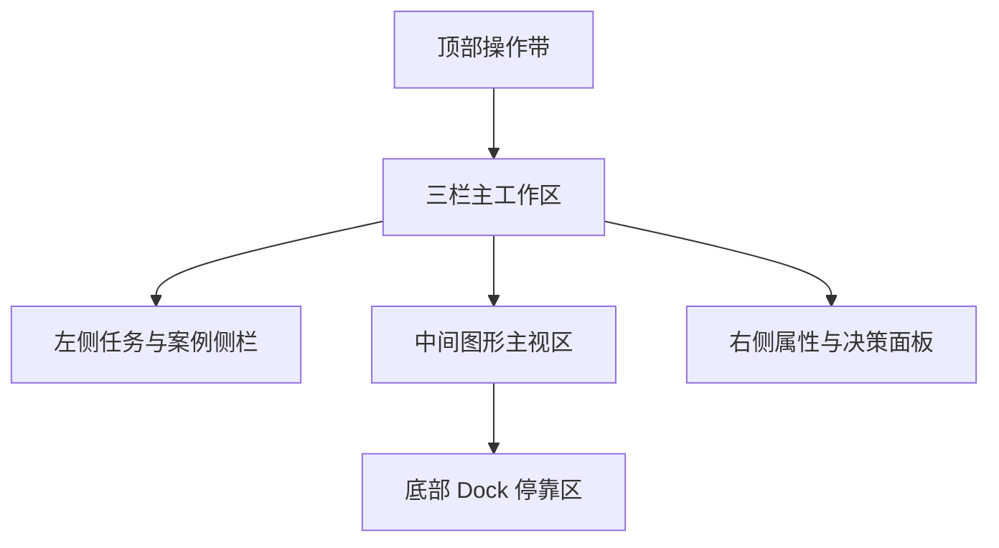

# 前端工作台改版设计

## 背景

当前前端已经具备完整的业务闭环，但页面观感和交互方式仍然明显偏向“演示型卡片页”。用户进入页面后，首先看到的是大段说明文案和多张同权重卡片，而不是一个清晰的工作台。结果是信息层级松散、主操作路径不够直接、页面滚动距离过长，而且整体视觉风格带有明显的 AI 生成感，不像专业仿真软件或工程工具。

这次改版的目标，不是单纯换一套颜色和圆角，而是把前端重构成“适合任务执行、结果查看和运行复盘”的中文仿真工作台。页面应当让用户一眼看出三件事：当前要在哪建任务，当前系统正在处理什么，当前结果或图形在哪里看。

## 改版目标

本次设计同时追求三个目标。第一，去掉当前页面的 AI 味和宣传页感，建立更专业、更克制、更稳定的工程软件视觉语言。第二，缩短高频操作路径，让提交任务、切换历史 run、确认执行、查看结果和重试运行这些动作更顺手。第三，把长内容和深层细节从主页面中心移开，让首页第一屏尽量服务于操作与判断，而不是服务于阅读。

本次改版默认使用中文界面。导航、状态、按钮、表单、辅助说明、时间线、报告入口等全部使用中文文案，只保留少量不适合强行翻译的技术标识，例如 `run_id`、`CFD`、`OpenFOAM` 和工具名。

## 不在本次改版范围内的内容

这次设计不引入新的外部能力，也不改变当前的后端业务链路。真实 Claude、真实 OpenFOAM、MCP 工具接入、案例检索算法和数据结构都不在这次前端改版范围内。改版过程中可以重组现有组件、增删局部展示模块、改变布局与文案，但不以新增复杂业务为目标。

## 方案选择

在界面方向上，本次设计从三类方案中选择了“仿真工作台”方向，并采用其中的平衡型密度版本。

第一类方向是更接近专业仿真软件的工作台布局，也就是顶部操作带、左侧参数与对象列表、中间主视图、右侧属性面板、底部停靠区。它最专业，也最适合这个项目后续继续承载图形、结果、对比和复盘能力。

第二类方向是引导式 studio，更强调流程步骤和初学者友好。它更轻，但专业软件气质不足，后续扩展复杂结果查看时也不如工作台结构自然。

第三类方向是精炼型 dashboard。它实现成本最低，但整体更像后台看板，不足以从根本上摆脱当前页面的问题。

综合考虑项目定位、参考视觉和后续扩展空间，本次设计采用第一类方向，并明确控制信息密度，避免把左右侧栏做成拥挤的“文字墙”。

## 总体布局

改版后的页面采用固定工作台骨架，而不是信息卡片平铺。整体结构如下：

### 顶部操作带

顶部不再承担宣传作用，而是承担全局状态与高频操作。左侧显示产品名和当前页面身份，中间显示当前 run、状态和执行引擎等全局信息，右侧显示刷新时间等轻量状态。操作带使用类似 ribbon 的视觉结构，但保持网页实现的轻量程度，不直接复刻桌面软件。

顶部仅保留高频动作，例如：`新建任务`、`导入几何`、`案例检索`、`确认执行`、`重试运行`、`导出报告`。这些按钮位置固定，不跟随内容漂移。

### 左侧任务与案例侧栏

左侧是操作型侧栏，用来承接“建任务、选案例、切历史 run”这条最常见路径。它由三个短面板组成：`任务输入`、`候选案例`、`历史运行`。左侧不承担长文本阅读任务，因此每一项都只显示必要信息。

任务输入面板只保留任务描述、任务类型、几何家族、工况说明和文件导入。候选案例面板默认只显示标题、匹配度和任务类型，不在列表内常驻长 rationale。历史运行面板只显示 `run_id`、状态、更新时间和快速操作入口。

### 中间图形主视区

中间区域是整个界面的视觉核心。它必须长期保留给图形与结果，不再被大段说明文字抢走。即使当前还没有真实 3D 视图，这里也应当像“图形工作区”而不是“图片卡片区”。

中间区域分为三个层级：最上方是视图标签，例如 `图形视图`、`结果对比`、`案例映射`；中间是双视窗布局，主视窗更大，副视窗更小；最下方连接底部 dock。默认状态下，主视窗展示当前最重要的几何/流线/结果图，副视窗展示压力分布、尾流切片或对比图。

### 右侧属性与决策面板

右侧是决策型面板，用来承接当前 run 的短摘要信息，而不是长篇说明。这里默认放置三个区块：`流程确认`、`关键指标`、`工具与产物摘要`。

流程确认区只显示流程摘要与默认假设，不在这里平铺完整阶段说明。关键指标区展示当前最适合“看一眼判断”的数字信息，例如进度、匹配度、队列位置和产物数。工具与产物摘要区只展示允许工具与预期产物的短列表。

### 底部 Dock 停靠区

所有长内容和深层细节都统一下沉到底部停靠区，不再让主页面无限变长。底部以标签页形式组织内容，建议包括：`时间线`、`运行事件`、`执行尝试`、`产物目录`、`最终报告`。

这意味着现在分散在主页面各处的时间线、事件、attempt、artifact 和报告内容，都将被重新收口到底部。这样页面第一屏始终保持“操作与判断优先”，而不是“阅读优先”。

## 信息密度原则

本次方案选择的是平衡型密度，而不是传统桌面软件那种高密参数面板。左右两侧都必须严格控制内容长度，避免文字堆积造成拥挤和阅读负担。

左侧只保留操作型信息，不保留长解释。右侧只保留摘要型信息，不保留长说明。凡是需要用户连续阅读三行以上的内容，默认都应当进入底部 dock，而不是常驻侧栏。

此外，侧栏内部应优先使用短标题、短说明、短状态标签和数值块。候选案例与历史 run 列表也应尽量采用“对象列表”而非“说明卡片”的形态。

## 交互规则

### 固定主操作

高频动作必须始终能在顶部操作带被找到。用户不应为了找“确认执行”或“重试运行”而先滚动页面或先阅读说明。

### 列表负责选择，对象负责阅读

左侧的候选案例列表和历史运行列表，职责是帮助用户快速切换对象，不是承载详细信息。点击列表项之后，再由中间主视区、右侧属性面板和底部 dock 同步刷新详细内容。

### 长内容默认下沉

流程详细说明、结构化事件、执行尝试、日志、产物详情和 Markdown 报告都不应占据第一屏主空间。它们默认进入底部标签页，按需查看。

### 状态统一

整站只保留一套状态词和一套状态颜色体系。推荐使用：`待确认`、`排队中`、`运行中`、`已完成`、`失败`、`已取消`。同一状态无论出现在顶部、左侧、右侧还是底部，文案与颜色都保持一致。

### 主视区必须始终有反馈

哪怕系统当前尚未产生真实结果图，也不能让主视区空着。未执行时显示几何/案例预览，占位也要像图形窗口。执行中显示当前阶段、图形占位和结果更新提示。执行完成后优先显示最有价值的结果图，而不是让主视区退化成空白容器。

### 关键操作贴近上下文

`确认执行` 可以同时出现在顶部操作带和右侧流程确认区。`取消排队` 只在排队状态可见。`重试运行` 主要跟随历史 run 和失败/完成态出现，不在无关状态下制造噪音。

## 视觉语言

视觉风格应从当前的深色玻璃卡片风切换为浅色工程工作台风。主背景使用冷调浅灰和雾白，不采用纯白，也不采用深色首页风。页面的专业感来自结构、边界和层级，而不是来自大量发光、渐变和营销化大标题。

主强调色建议使用一套工程蓝。状态色单独服务于状态表达：`待确认` 使用灰蓝，`排队中` 使用琥珀，`运行中` 使用蓝，`已完成` 使用青绿，`失败` 使用红。颜色要服务于语义，而不是装饰。

圆角和阴影也应收敛。边框要更清楚，模块要更硬朗，阴影要更轻。总体目标是让用户一眼感觉这是一个工作台工具，而不是一个 AI 产品落地页。

## 中文文案原则

文案需要从“说明书中文”和“大模型中文”切换到“软件中文”。按钮与面板名尽量短，说明语尽量像属性提示而不是宣传语。建议优先使用如下方向：

- `新建任务`
- `导入几何`
- `候选案例`
- `流程确认`
- `运行事件`
- `执行尝试`
- `产物目录`
- `最终报告`

不建议继续使用过长按钮文案，例如“生成候选案例与推荐流程”这样的句子。能用短语解决的，不用完整句。

## 组件重组建议

现有前端组件不需要全部推翻，但需要重新组织职责。

`TaskForm`、`CandidateCases` 和 `RunHistoryPanel` 应当被重组到左侧工作栏中，并共享统一的侧栏视觉风格。`WorkflowDraft` 应当拆成两部分：摘要信息进入右侧属性面板，详细阶段说明进入底部 dock。`RunTimeline` 和 `ArtifactsPanel` 的大部分深层内容要被重新收口到底部停靠区，不再作为主页面等权大块独立出现。

`App.tsx` 应从当前的卡片瀑布流改成固定工作台骨架，负责组织顶部、左侧、中间、右侧和底部五块区域，并控制不同区域在各种 run 状态下的显隐逻辑。

## 响应式策略

桌面端优先采用三栏工作台。中间视区始终优先保留最大空间，左右侧栏宽度固定在克制范围内，不随内容无限膨胀。

在较窄屏幕上，布局允许折叠为上下结构，但信息分组关系不变。顶部操作带仍保留，左侧与右侧内容转为堆叠，中间主视区优先保留，底部 dock 继续负责深层细节。

## 错误处理与状态空态

错误提示不应再以突兀的通栏警示条为主要体验，而应更多结合当前区域上下文。例如任务提交失败优先在任务输入区域提示，运行失败优先在右侧状态区和底部事件页提示。全局错误保留，但要更克制。

空态设计也需要更专业。无当前 run 时，主视区显示“等待任务导入或选择历史运行”的图形工作区占位；无结果图时，主视区显示预览占位；无底部内容时，用简短说明代替空白大片区域。

## 验收标准

本次改版完成后，应满足以下体验标准：

1. 用户进入页面后，无需滚动即可看清主要操作入口、当前 run 状态和主结果视区。
2. 页面不再存在首页式大段宣传文案，第一屏以操作与判断为主。
3. 左右侧栏不出现长文本堆积，长内容统一下沉到底部 dock。
4. 中文文案统一、简洁，整体观感更接近专业仿真工作台。
5. 高优先级操作路径更短：建任务、切历史 run、确认执行、查看结果、重试运行都应在 1 到 2 次操作内完成。

## 实现顺序建议

实现时建议分三步推进。第一步先完成页面骨架重组，也就是 `App.tsx` 布局和全局区域拆分。第二步再重构左右侧栏、中间主视区和底部 dock，完成组件职责重分。第三步最后统一文案、状态标签、颜色体系和细节样式，把 AI 味和卡片感彻底清掉。

## 说明

当前工作区不是 git 仓库，因此本次设计文档无法按常规流程提交 commit。文档仍已按规格路径保存，后续在用户确认后可直接进入实现计划阶段。
