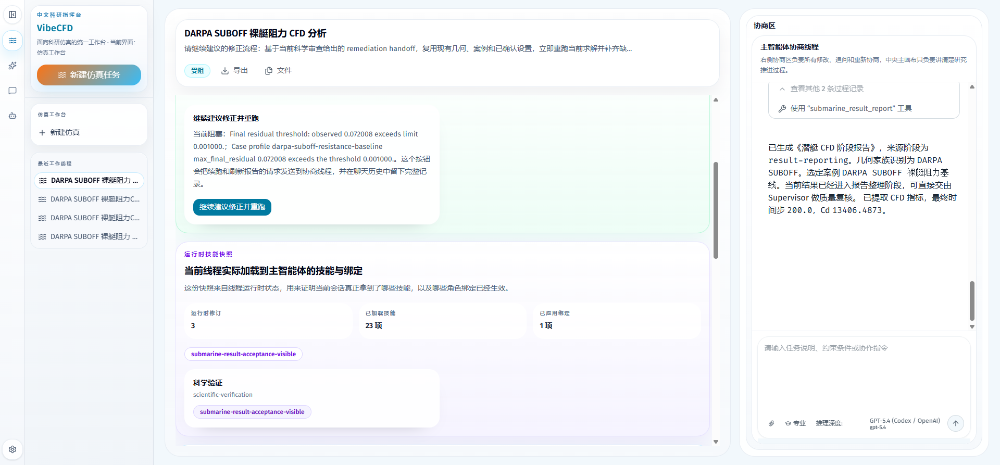

# VibeCFD 用户使用指南

这是一份面向真实用户操作的使用手册，覆盖当前版本里最重要的两条链路：

- 从前端完整发起一条潜艇 CFD 任务，看到中间产物、求解过程、最终报告和后续修正建议
- 在 Skill Studio 中创建、试跑、保存生命周期、发布 skill，并确认它已经对运行中的智能体生效

本文所有截图都来自当前已经实际验证过的界面与线程结果。页面文案如果后续有小幅调整，请以当前界面上的真实按钮、状态和文件名为准。

## 1. 先知道这份指南怎么用

如果你是第一次使用 VibeCFD，建议先记住下面四个原则：

1. 真正的输入都发生在右侧聊天区或底部输入框里。
2. 主画布负责展示阶段状态、证据和“下一步”按钮。
3. 看到主画布按钮时，优先点击主画布按钮，不要再额外重复提交一次。
4. 系统即使把流程跑通，也可能基于科学门控诚实地给出 `blocked_by_setup` 或 `delivery_only`，这不是假失败，而是系统在阻止过度宣称。

## 2. 使用前准备

### 2.1 启动三项本地服务

建议分别打开三个终端窗口，在仓库根目录执行下面三组命令。

1. 前端

```powershell
corepack pnpm --dir frontend dev --hostname 127.0.0.1 --port 3000
```

2. Gateway

```powershell
Set-Location backend
uv run uvicorn app.gateway.app:app --host 127.0.0.1 --port 8001
```

3. LangGraph Runtime

```powershell
Set-Location backend
uv run python -m langgraph_api.cli --host 127.0.0.1 --port 2127 --no-reload
```

### 2.2 启动后应该先检查什么

至少确认下面两个页面能打开：

- `http://127.0.0.1:3000/workspace/submarine/new`
- `http://127.0.0.1:3000/workspace/skill-studio/new`

如果这两个页面都能加载出来，说明前端已经和当前工作区代码连通。

### 2.3 准备测试几何文件

本文默认使用下面这个已经多次验证过的示例几何：

- `C:\Users\D0n9\Desktop\suboff_solid.stl`

如果你换成自己的 STL，也可以按同样流程操作，但本文里的数值样例就不一定和你的界面一致了。

### 2.4 先认一遍工作区

左侧导航有四个核心入口：

- **仿真工作台**：发起和继续潜艇 CFD 任务
- **技能工作台**：创建、试跑、发布 skill
- **对话**：查看历史线程、消息和文件产物
- **智能体**：进入某个专门 agent 的会话


这张图最重要的作用，是帮助你建立一个基本心智模型：

- 左侧是入口
- 中间是主画布
- 右侧是聊天与文件证据区

## 3. 先认路：对话和智能体页面

### 3.1 对话页面用来找回历史线程

如果你不是从零开始，而是回来继续之前的任务，优先去 **对话** 页面看历史线程。


在这个页面里，建议你优先看三件事：

- 线程停在什么阶段
- 最后一条用户消息是什么
- 右侧文件区里已经产出了哪些 `artifact`

### 3.2 智能体页面用来和专门角色对话

如果你想直接进入某个专门 agent 的会话，可以去 **智能体** 页面。


点击具体智能体后，会进入它自己的会话页。


大多数真实 CFD 任务仍然建议从 **仿真工作台** 发起，因为那条链路会把主画布、聊天记录和文件产物自动串起来。

## 4. 潜艇 CFD 全链路操作指南

这一章按真实用户视角，把“新建线程 -> 上传 STL -> 预检 -> 确认 -> 设计简报 -> 执行 -> 报告 -> remediation follow-up”整条链路完整走一遍。

### 4.1 新建一条潜艇 CFD 线程

打开：

```text
http://127.0.0.1:3000/workspace/submarine/new
```

你会看到一个双区布局：

- 中间主画布：展示研究切片、状态、证据和下一步动作
- 右侧聊天区：你真正输入消息、上传附件、查看消息与文件的地方


这一步最容易犯的错，是把主画布当成输入区。请记住：

- 主画布不是输入框
- 真正的输入发生在右侧聊天区和底部输入框

### 4.2 上传 STL 并发送第一条任务说明

在右侧输入区按下面顺序操作：

1. 点击 **添加附件**
2. 选择 `suboff_solid.stl`
3. 在底部输入框粘贴任务说明
4. 点击 **提交**


推荐直接使用下面这段首条消息：

```text
请基于我上传的 suboff_solid.stl，做一轮 DARPA SUBOFF 裸艇阻力基线 CFD 分析。
默认采用水下直航工况，自由来流速度 5 m/s，流体为水。
请先做几何预检，并把需要我确认的事项明确逐项列出来。
```

发送后，你应该立刻看到这些信号：

- 右侧聊天历史出现上传记录和你的任务说明
- 主画布切到与几何预检相关的研究切片
- 文件区开始出现 `geometry-check.*` 之类的产物

### 4.3 查看几何预检和待确认事项

预检完成后，系统会明确列出待确认项，而不是只说“有几项需要确认”。


你通常会在这个阶段看到：

- **参考长度**
- **参考面积**
- 每一项的建议值
- 每一项的来源，例如 `geometry-preflight`
- 哪些项属于必须先确认才能继续推进的项

这里最重要的不是“看懂了就行”，而是你要真的回一条确认消息。

### 4.4 发送确认消息，推进到设计简报

如果你希望确认动作尽量稳，建议用显式确认句式，而不是一句很口语化的“继续吧”。


推荐模板如下。请注意，数值以你自己界面上当前显示的值为准，下面只是已验证案例里的示例：

```text
确认两项关键值并继续：参考长度=4.356 m；参考面积=0.370988 m^2；
confirmation_status=confirmed；execution_preference=execute_now。
请立即继续生成设计简报，并在设计简报完成后显示前端可见的“开始实际求解执行”按钮。
```

这条消息之所以稳，是因为它同时表达了四件事：

- 你确认了关键参考量
- 你允许系统继续推进
- 你明确要求进入设计简报阶段
- 你明确要求系统在简报完成后给出前端可见的下一步动作

确认成功后，你应该看到：

- 聊天区出现你的确认消息
- 系统推进到 `submarine_design_brief`
- 文件区新增 `cfd-design-brief.json`、`cfd-design-brief.md`、`cfd-design-brief.html`
- 主画布出现 **开始实际求解执行** 按钮

### 4.5 理解“开始实际求解执行”按钮到底做了什么

这个按钮不是装饰，也不是后台偷偷完成的隐藏动作。它是一个真正的、用户可见的前端动作。

当你点击它时，系统会：

- 自动向右侧聊天线程发出一条清晰的执行请求
- 把这条请求留在聊天历史里
- 然后继续推进 `submarine_solver_dispatch`


这一步请特别记住一句话：

> 点击主画布上的 **开始实际求解执行** 后，不要再额外点击底部输入框的 **提交**。

原因很简单：

- 主画布按钮本身已经完成“发消息”动作
- 再点一次底部 **提交**，相当于你又手动发了一条新的输入

### 4.6 等待求解派发，并检查求解产物

点击执行按钮后，右侧聊天区会先出现执行请求，随后出现 `submarine_solver_dispatch` 的工具结果。文件区会逐步产出求解相关文件。


你应该重点检查下面这些文件是否出现：

- `dispatch-summary.md`
- `dispatch-summary.html`
- `openfoam-request.json`
- `provenance-manifest.json`
- `openfoam-run.log`
- `solver-results.json`
- `solver-results.md`
- `stability-evidence.json`

在一些更完整的研究链路里，你还可能看到扩展验证产物，例如：

- `verification-mesh-independence.json`
- `verification-domain-sensitivity.json`
- `verification-time-step-sensitivity.json`
- 多个 `studies/.../solver-results.json`

如果你在右侧文件区看到了这些关键文件，说明求解派发和基础结果产出已经发生了。

### 4.7 生成最终结果报告

当求解阶段完成后，主画布会显示 **生成最终结果报告**。这一步和执行阶段一样，优先使用主画布按钮，而不是自己再敲一条新消息。


点击后，系统会推进 `submarine_result_report`，并在文件区生成结果报告相关产物。建议你重点看下面这些文件：

- `final-report.md`
- `final-report.html`
- `final-report.json`
- `delivery-readiness.md`
- `delivery-readiness.json`
- `research-evidence-summary.json`
- `supervisor-scientific-gate.json`
- `scientific-remediation-plan.json`
- `scientific-remediation-handoff.json`

其中：

- `final-report.*` 适合给用户或团队看完整结果
- `delivery-readiness.*` 适合看当前结果是否允许交付
- `supervisor-scientific-gate.json` 适合看科学门控为什么放行或拦截

### 4.8 为什么“报告生成了”仍可能被系统拦住

当前版本里，一个非常重要的产品语义是：

- 软件流程可以跑通
- 科学结论不一定被允许直接宣称

也就是说，系统可能已经生成报告，但仍然明确告诉你当前案例只能停留在 `delivery_only`，或者当前状态是 `blocked_by_setup`。



这个阶段你要看清楚四类信息：

- 当前科学判断，例如 `blocked_by_setup`
- 当前允许的 claim level，例如 `delivery_only`
- 明确阻塞原因，例如 residual summary 不足或阈值不达标
- 主画布是否给出了 **继续建议修正并重跑** 按钮

请不要把这个状态理解成“系统坏了”。更准确的理解是：

- 软件执行链路是通的
- 但科学证据还不足以支持研究级结论

### 4.9 使用“继续建议修正并重跑”

当主画布给出 **继续建议修正并重跑** 按钮时，说明系统已经准备好了 remediation handoff。此时建议优先点击这个可见按钮，而不是重新写一大段自由文本。


这个动作会让系统继续做四件事：

- 读取当前线程里的 remediation handoff
- 复用现有几何、案例和已确认设置
- 重新推进求解和报告刷新
- 把 follow-up 过程继续留在聊天历史与文件区里

follow-up 执行后，请重点检查是否新增了这个文件：

- `scientific-followup-history.json`

这个文件非常关键，因为它证明：

- follow-up 确实执行过
- 它是从哪个 remediation handoff 开始的
- 它刷新了哪些 solver / report 产物
- 它最后停在什么结论上

### 4.10 如何判断一条潜艇线程是否真的“从前端完整跑通”

如果你想快速判断一条线程是否已经从用户视角完整跑通过，请检查同一条线程里是否同时具备下面这些痕迹：

1. 你的 STL 上传记录
2. 你的首条任务说明
3. 几何预检结果
4. 明确列出的待确认事项
5. 你的确认消息
6. `submarine_design_brief`
7. 主画布可见的 **开始实际求解执行**
8. `submarine_solver_dispatch`
9. 主画布可见的 **生成最终结果报告**
10. `submarine_result_report`
11. 主画布可见的 **继续建议修正并重跑**
12. `submarine_scientific_followup`
13. `scientific-followup-history.json`

只要这些都在同一条前端线程里留下了可见记录，就说明整条链路已经从用户视角跑通。

## 5. Skill Studio 全链路操作指南

这一章对应另一条同样重要的链路：创建 skill、试跑、保存生命周期、发布，并验证它已经进入运行时。

### 5.1 新建一条 Skill Studio 线程

打开：

```text
http://127.0.0.1:3000/workspace/skill-studio/new
```


第一次进入时，建议你在首条消息里说清楚五件事：

- 这个 skill 解决什么问题
- 它服务哪个角色或哪个智能体
- 它需要什么输入
- 它必须输出什么
- 哪些标签、判断或证据必须显式出现

### 5.2 等待草稿和验证材料生成

提交首条需求后，系统会逐步在同一条 skill 线程里生成草稿与验证材料。


常见文件包括：

- `skill-draft.json`
- `validation-report.json`
- `test-matrix.json`
- `dry-run-evidence.json`
- `skill-lifecycle.json`
- `publish-readiness.json`
- `skill-package.json`

如果你不知道该先看什么，推荐顺序是：

1. `validation-report.json`
2. `test-matrix.json`
3. `dry-run-evidence.json`
4. `publish-readiness.json`

### 5.3 记录 dry-run 结果

当你已经根据页面里的场景把 skill 试跑过一遍后，可以直接在页面中记录 dry-run 的结果。


你通常会看到两类动作：

- **记录试跑通过**
- **记录试跑失败**

记录后，系统会把结果写回 `dry-run-evidence.json`，并同步刷新发布门槛。也就是说，dry-run 不是只存在于你的脑子里，而是会留下可追踪证据。

### 5.4 保存生命周期设置

当前版本已经支持在 skill 尚未发布前，直接保存生命周期设置。


你可以在这个阶段配置：

- 版本说明
- 绑定角色
- 启用状态

点击 **保存生命周期设置** 后，当前版本不应该再出现历史上的那个老问题：

- `404 Custom skill not found`

如果这一动作成功，说明“草稿态 skill 的生命周期信息也能被正确持久化”这条链路已经通了。

### 5.5 发布当前草稿

当 dry-run 已完成、发布条件满足后，就可以点击 **发布当前草稿**。


发布成功后，建议你对照页面确认下面几项：

- `活动版本 = rev-001`
- `已发布版本 = rev-001`
- `版本数量 = 1`
- `绑定数量 = 1`
- 绑定目标里出现 `科学验证 -> submarine-result-acceptance-visible`

如果这些信息都已经在页面上出现，说明这次发布不是“后台说成功”，而是用户在前端可见地确认了发布状态。

### 5.6 验证发布后的 skill 已经进入运行时

发布成功不等于运行时已经生效。正确的最终验证方式是：

1. 新开一条潜艇线程
2. 正常发起一次潜艇任务
3. 在主画布中查看 **运行时技能快照**


在这个快照里，你应该能直接看到：

- **运行时修订**
- **已加载技能**
- **已应用绑定**
- 具体 role 与 skill 的映射关系

当前版本里，已经验证过的典型绑定证明是：

- `scientific-verification`
- `submarine-result-acceptance-visible`

这一页的意义非常大，因为它证明的不是“skill 发布过”，而是“skill 真的被当前运行中的主智能体加载到了运行时”。

## 6. 可直接复制的提示词模板

### 6.1 潜艇任务首条消息

```text
请基于我上传的 suboff_solid.stl，做一轮 DARPA SUBOFF 裸艇阻力基线 CFD 分析。
默认采用水下直航工况，自由来流速度 5 m/s，流体为水。
请先做几何预检，并把需要我确认的事项明确逐项列出来。
```

### 6.2 潜艇确认消息

请注意，下面的参考长度和参考面积只是示例。实际发送时，请以你自己页面上显示的值为准。

```text
确认两项关键值并继续：参考长度=4.356 m；参考面积=0.370988 m^2；
confirmation_status=confirmed；execution_preference=execute_now。
请立即继续生成设计简报，并在设计简报完成后显示前端可见的“开始实际求解执行”按钮。
```

### 6.3 如果你想主动要求系统生成最终报告

```text
请基于当前已完成的潜艇 CFD 求解与后处理结果，生成最终结果报告，并明确给出关键结论、证据边界、交付产物路径与下一步建议。
```

### 6.4 如果你想主动要求系统继续 remediation follow-up

```text
请继续建议的修正流程：基于当前科学审查给出的 remediation handoff，
复用现有几何、案例和已确认设置，立即重跑当前求解并补齐缺失的 solver metrics，
然后刷新结果报告。整个过程请保持在当前线程中可追踪。
```

### 6.5 Skill Studio 首条需求模板

```text
请帮我创建一个用于科学验证阶段的 skill。
它要服务 scientific-verification 角色，输入是当前潜艇 CFD 线程的求解结果、报告与科学门控信息，
输出必须包含是否满足接受条件、阻塞原因、需要补充的证据，以及适合写回线程的结构化结论。
请同时生成草稿、验证矩阵、dry-run 建议和发布前检查材料。
```

## 7. 常见问题与排查

### 7.1 我点了主画布按钮，为什么底部输入框也像是有动作了

因为主画布按钮本质上就是在帮你向聊天线程发送一条结构更清晰的消息。

因此：

- 点击主画布按钮一次就够了
- 不要再额外点一次底部 **提交**

### 7.2 为什么我已经拿到报告了，却看到 `blocked_by_setup` 或 `delivery_only`

这通常不是软件故障，而是科学门控在工作。它表示：

- 软件链路通了
- 但当前案例还不满足研究级结论发布条件

也就是说，系统是在诚实拦截，而不是假装成功。

### 7.3 为什么旧线程里看不到我刚发布的新 skill

运行时技能快照是在“线程实际运行时”捕获的。

如果这条线程创建于 skill 发布之前，它通常会保留旧快照。要验证新绑定，请重新新建一条线程再跑一次。

### 7.4 Skill Studio 保存生命周期设置时如果失败怎么办

优先检查下面三件事：

1. Gateway 是否正在运行
2. 当前 skill 线程里是否已经生成草稿
3. 你打开的是不是当前这套真实工作区对应的页面

如果问题仍然存在，再去看该线程的 `skill-lifecycle.json`、`validation-report.json` 和浏览器网络请求。

### 7.5 我怎么判断文件区里的结果够不够交付给别人

可以按这个顺序判断：

1. 是否已经有 `final-report.*`
2. 是否已经有 `delivery-readiness.*`
3. 是否已经有 `supervisor-scientific-gate.json`
4. 当前结论是不是仍停在 `delivery_only`

如果还停在 `delivery_only`，就说明可以把它当成流程结果或受控交付结果看，但不应该把它包装成研究级有效结论。

## 8. 当前版本的真实交付边界

截至本文对应的版本，下面两条链路已经从前端视角完整验证过：

1. 潜艇 CFD 可见链路
   上传 -> 几何预检 -> 待确认项 -> 设计简报 -> 可见执行按钮 -> 求解派发 -> 可见报告按钮 -> 最终报告 -> 可见 remediation follow-up -> `scientific-followup-history.json`

2. Skill Studio 可见链路
   创建 skill -> dry-run -> 保存生命周期 -> 发布 -> 在新线程中验证运行时绑定

这意味着当前版本已经适合：

- 做真实试用
- 做受控演示
- 做带边界说明的交付

但请同时带着下面这句真实说明一起交付：

> VibeCFD 现在已经能够从前端完整推进任务并保留证据链，但系统会对不满足科学门控的结果明确给出阻塞结论，而不是假装已经研究验证通过。
