# VibeCFD 用户使用说明

这份手册面向当前 `main` 工作线的真实界面，适合两类用户：

- 想直接在浏览器里发起潜艇 CFD 任务、查看中间结果、继续求解、导出报告的使用者
- 想在 **技能工作台** 里创建、试跑、发布技能，并确认这些技能已经真正对运行中的智能体生效的使用者

文中图片均来自当前版本的实际页面，不是示意图。

## 1. 使用前准备

建议同时启动三项本地服务：

1. 前端

```powershell
corepack pnpm --dir frontend exec next dev --hostname 127.0.0.1 --port 3000
```

2. Gateway

```powershell
Set-Location backend
$env:PYTHONPATH='.'
uv run uvicorn app.gateway.app:app --host 127.0.0.1 --port 8001
```

3. LangGraph Runtime

```powershell
Set-Location backend
uv run langgraph dev --host 127.0.0.1 --port 2127 --no-browser --allow-blocking --no-reload
```

启动后，建议依次确认：

- 前端可访问：`http://127.0.0.1:3000/workspace/chats`
- Gateway 健康检查可访问：`http://127.0.0.1:8001/health`
- Runtime 健康检查可访问：`http://127.0.0.1:2127/ok`

## 2. 工作区总览

VibeCFD 左侧固定有四个主要入口：

- **仿真工作台**：发起和继续潜艇 CFD 任务
- **技能工作台**：创建、验证、发布技能
- **对话**：统一查看历史线程、结果文件、上下文
- **智能体**：按角色进入专用 agent 对话

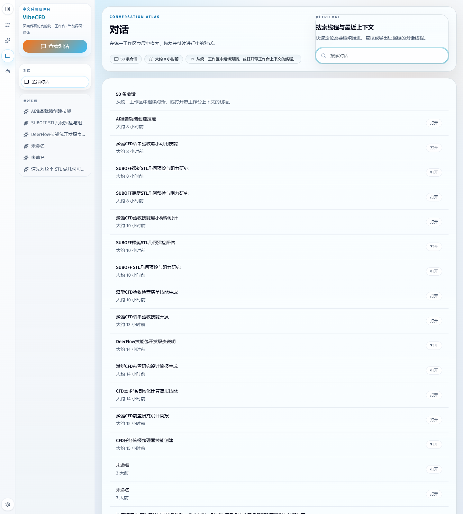

进入系统后，建议先从 **对话** 或 **仿真工作台** 进入，而不是立刻新建。这样你可以先确认：

- 之前有没有已经跑到一半的线程
- 有没有可直接复用的结果文件
- 当前项目里有哪些技能线程和仿真线程

## 3. 对话与智能体入口

### 3.1 对话页适合做什么

对话页适合统一恢复上下文、下载已有产物、跳转到专用工作台。

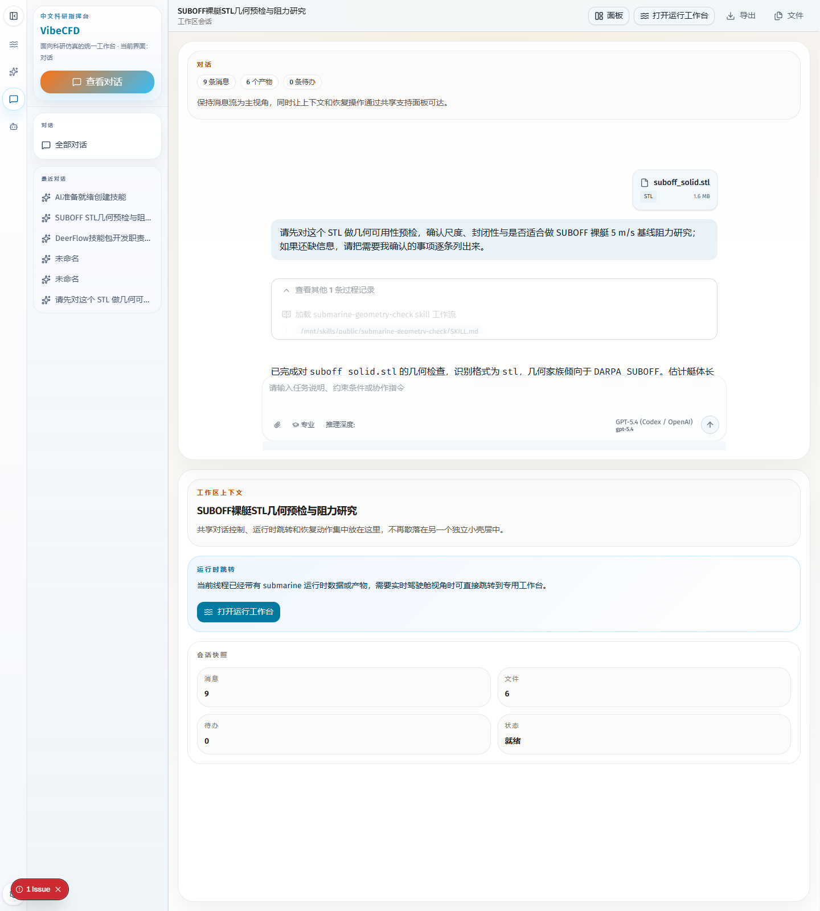

在对话详情页，推荐按下面顺序查看：

1. 先看页面标题，确认你打开的是哪条线程。
2. 再看消息历史，确认最后一条用户输入和系统输出是什么。
3. 再看右侧文件面板，确认这条线程已经产出了哪些 `artifact`。
4. 如果要继续操作，跳回专用工作台继续，而不是只停留在聊天视图。

### 3.2 智能体页适合做什么

如果你想直接和某个专用 agent 协作，而不是从普通对话开始，可以进入 **智能体** 页。

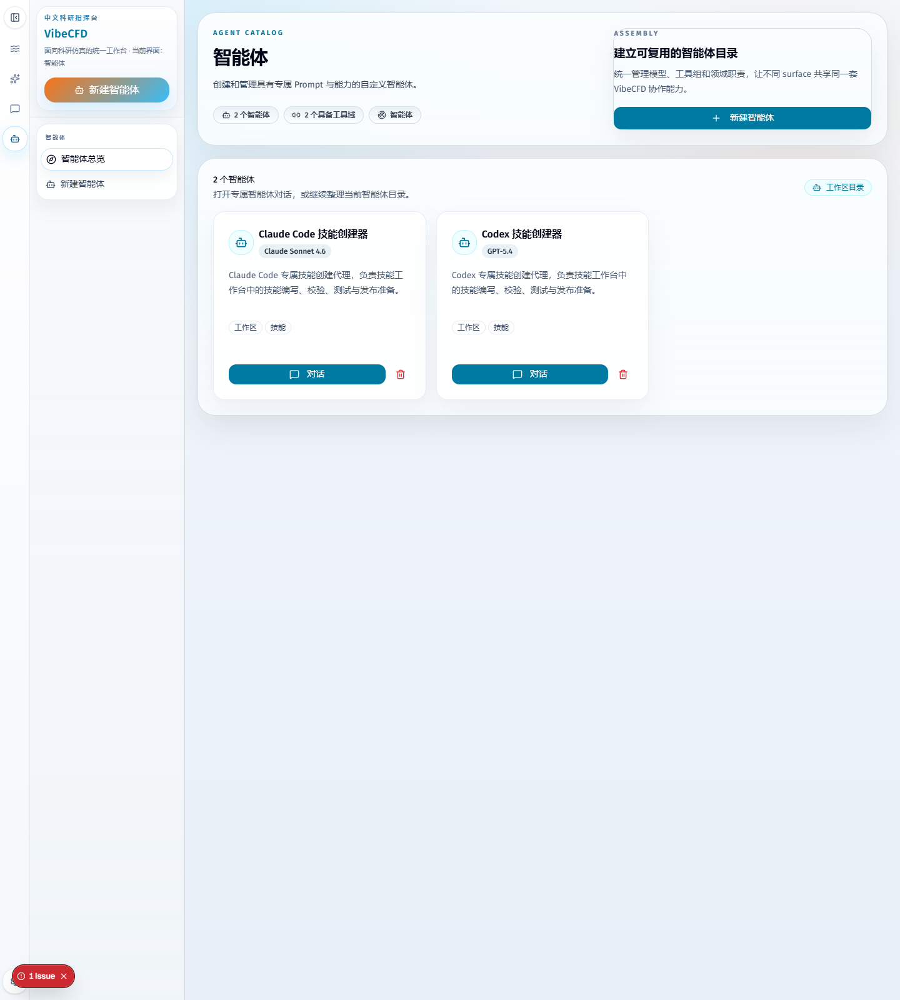

点击具体智能体后，会进入它的专属对话页：

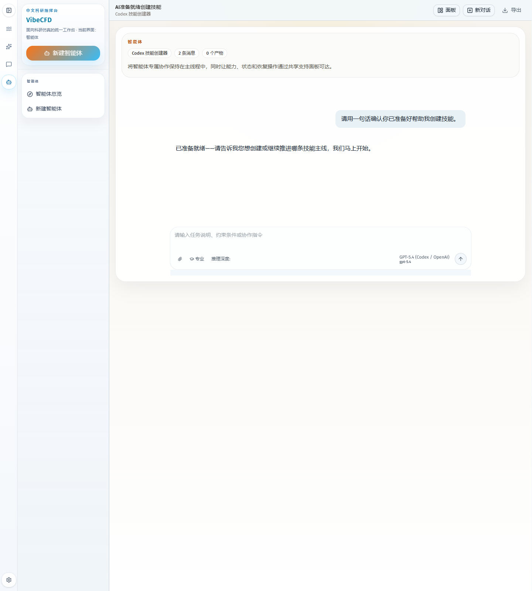

这个入口适合：

- 长期围绕同一类任务反复协作
- 直接进入技能创建、结果审阅之类的固定角色上下文
- 避免每次都重新解释“你现在扮演什么角色”

## 4. 仿真工作台完整流程

这一章对应潜艇 CFD 的主使用链路：上传几何、确认输入、执行求解、继续修正、查看最终报告。

### 4.1 新建潜艇任务

进入 `http://127.0.0.1:3000/workspace/submarine/new`。

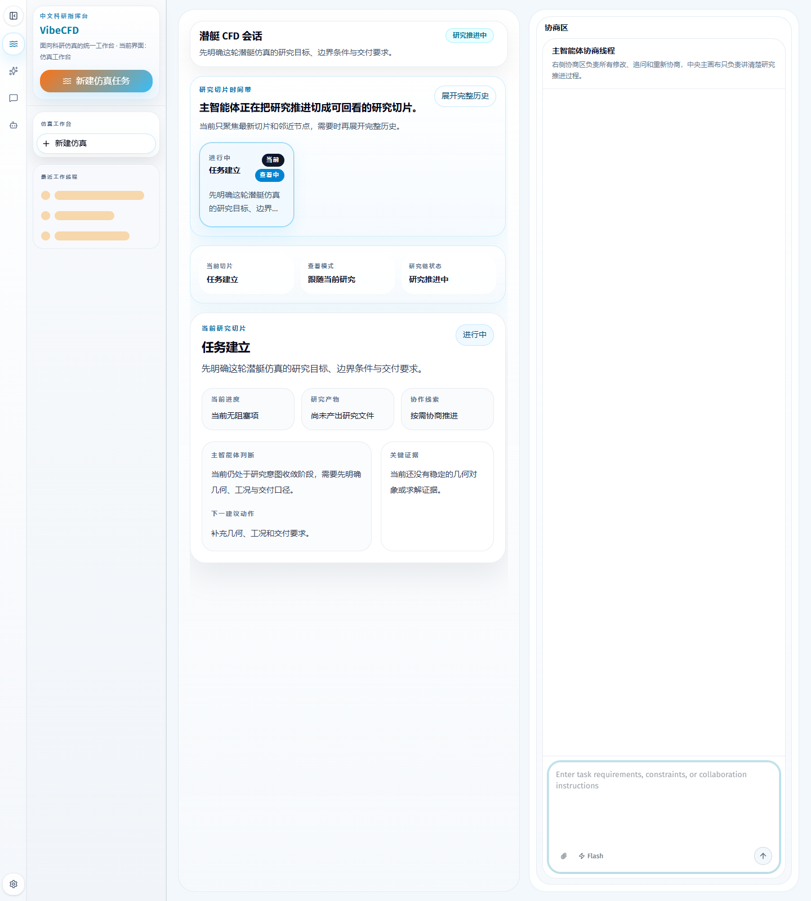

你会看到两个核心区域：

- 中央主画布：展示研究切片、当前状态和已沉淀证据
- 右侧协商区：所有真实输入都从这里提交，中央画布不会偷偷替你执行后台操作

### 4.2 上传 STL 并提交任务说明

建议使用真实几何文件，例如：

- `C:\Users\D0n9\Desktop\suboff_solid.stl`

在右侧输入框里说明你的目标，例如：

```text
请先对刚上传的 STL 做几何预检，并准备 DARPA SUBOFF 裸艇阻力基线 CFD 方案；先不要实际执行，等我确认参考长度、参考面积后再执行。
```

系统会先进入几何预检和任务建立阶段，而不是立刻求解。

### 4.3 确认待补输入

当系统认为还有待确认信息时，中央画布会把重点放在“待确认事项”和当前研究切片上。

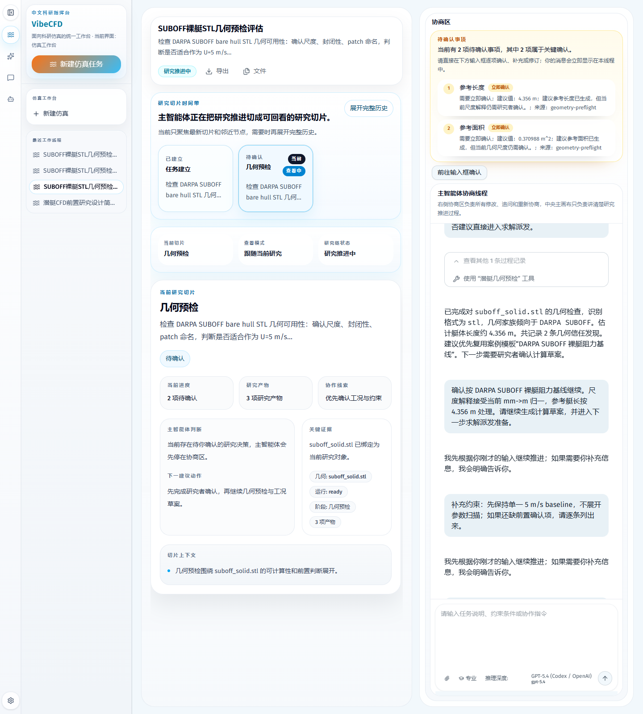

这一步通常需要你明确：

- 参考长度
- 参考面积
- 工况类型
- 是否立即执行
- 输出目标，例如阻力系数、尾流、图表、阶段报告

### 4.4 从主画布发起可见下一步

当前版本里，中央主画布会直接给出 **可见下一步** 按钮。它们有两个重要特征：

- 不会绕过前端偷偷触发后台
- 点击后会把清晰的请求发到右侧协商线程，并在聊天历史里留下记录

常见按钮包括：

- **开始实际求解执行**
- **生成最终结果报告**
- **继续建议修正并重跑**

这意味着用户只看前端，也能知道“是谁发起了下一步、发起了什么、系统如何回应”。

### 4.5 查看求解结果与最终报告

当线程推进到结果整理或交付判断阶段时，主画布会显示：

- 当前研究切片
- 主智能体判断
- 下一建议动作
- 关键证据
- 右侧文件面板中的报告和中间产物

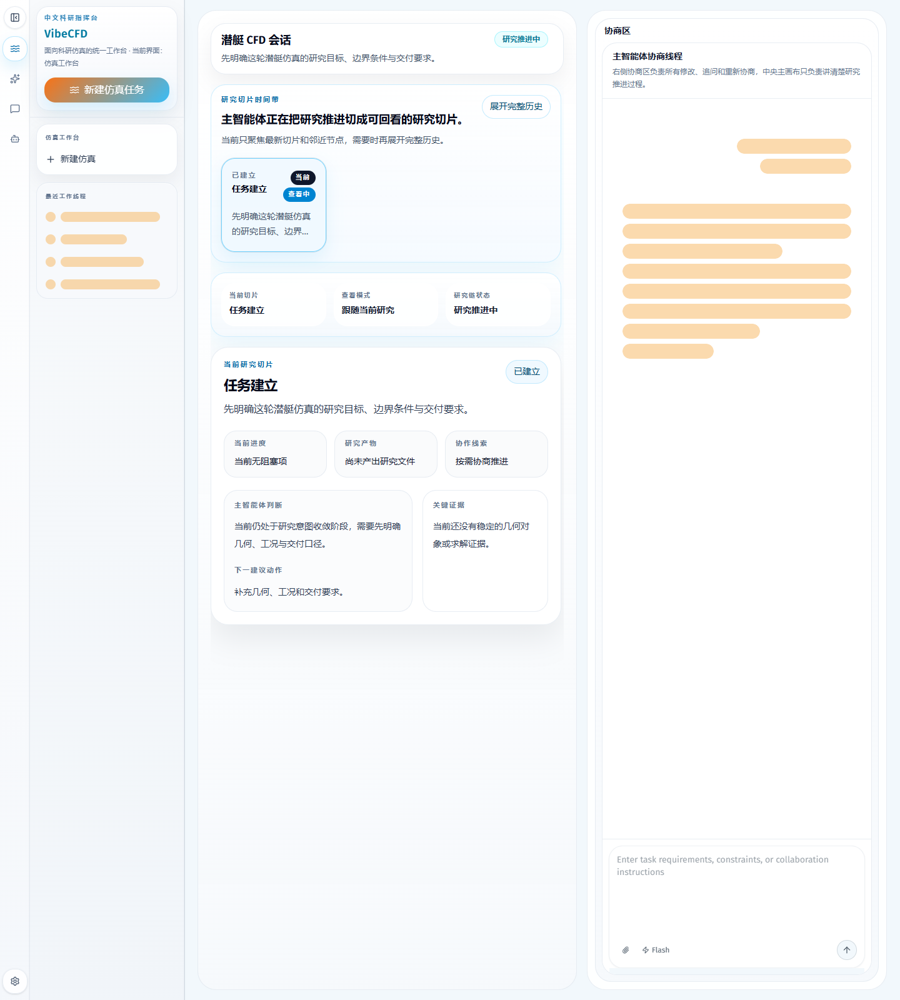

如果你想回到更接近消息历史的视角，可以再从对话页打开该线程：

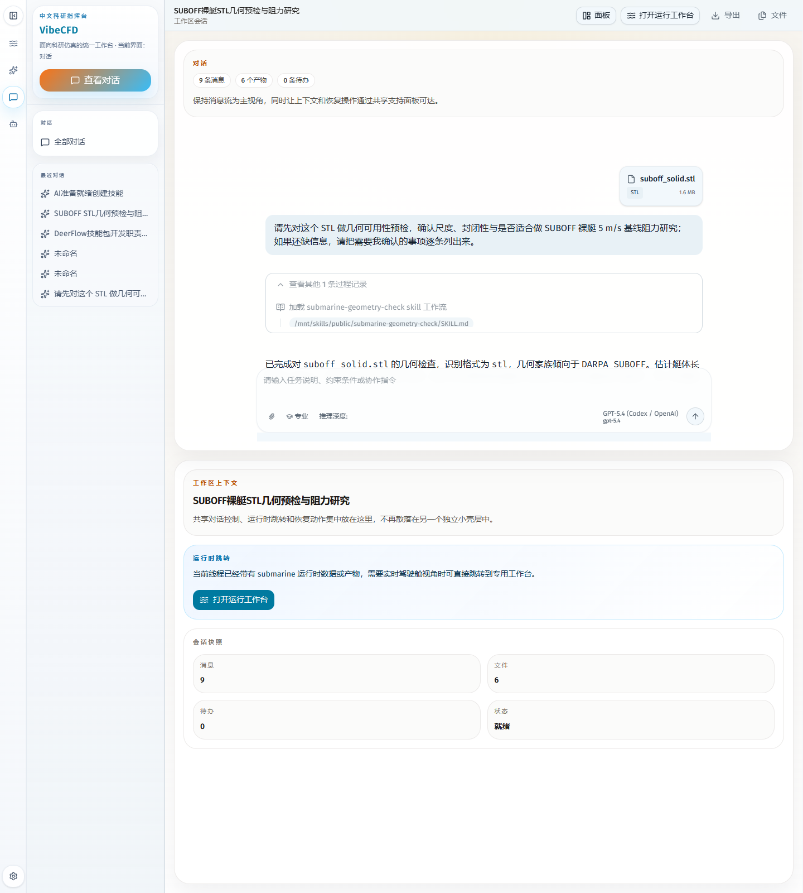

在当前版本中，你通常可以从右侧文件区看到这些关键文件：

- `cfd-design-brief.json`
- `dispatch-summary.md`
- `solver-results.json`
- `stability-evidence.json`
- `final-report.md`
- `final-report.json`
- `delivery-readiness.json`

## 5. 技能工作台完整流程

这一章对应 Skill Studio 的主链路：创建草案、验证、试跑、保存生命周期、发布。

### 5.1 新建技能资产

进入 `http://127.0.0.1:3000/workspace/skill-studio/new`。

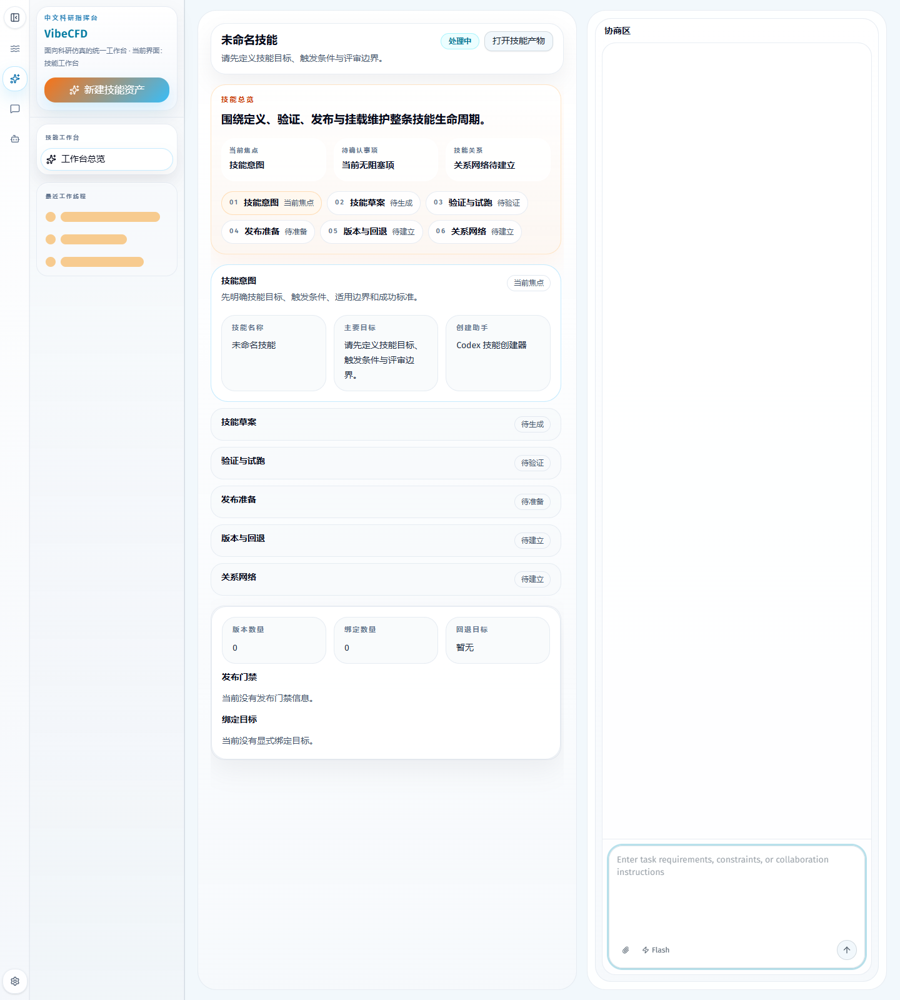

推荐直接用自然语言描述：

- 技能要解决什么问题
- 由哪个角色调用
- 需要输出什么结构
- 哪些字段是必须项
- 哪些标识必须出现

### 5.2 等待系统生成草案与验证材料

系统会逐步生成：

- `skill-draft.json`
- `validation-report.*`
- `test-matrix.*`
- `publish-readiness.*`
- `skill-package.json`
- `.skill` 打包文件

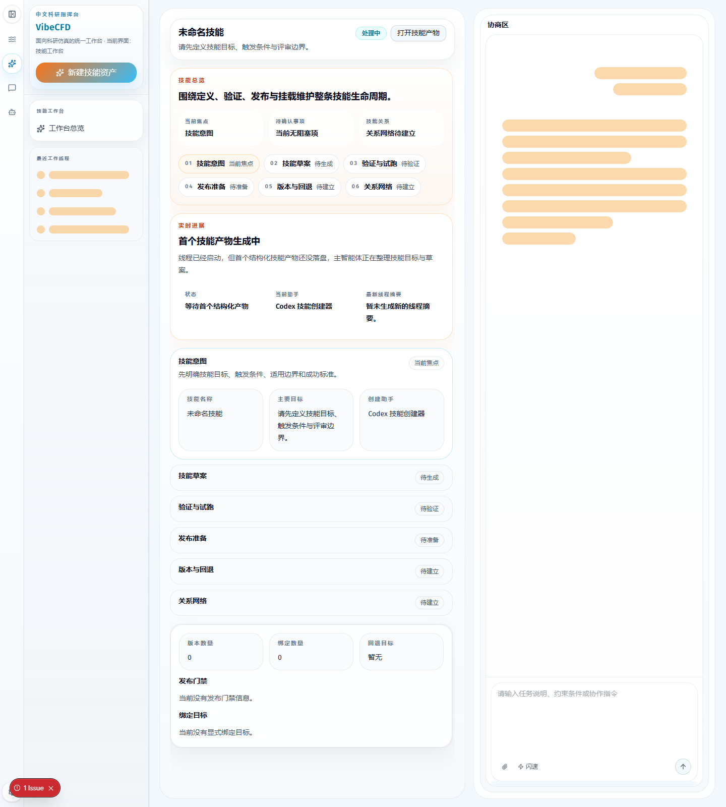

在这个页面里，建议按下面顺序操作：

1. 先看 **验证与试跑证据**。
2. 再看 **发布状态与版本信息**。
3. 最后看 **关系网络**。

### 5.3 记录试跑结果

只要测试矩阵里已经准备好场景，你就可以通过聊天框发起 dry-run，然后在页面上点击：

- **记录试跑通过**
- **记录试跑失败**

当前版本中，试跑结果会写入 `dry-run-evidence.json`，并重新刷新发布门禁。

### 5.4 保存生命周期设置

现在的版本已经支持在**尚未发布**时保存生命周期信息。你可以在页面上直接设置：

- **版本说明**
- **显式挂载角色**
- **启用状态**

点击 **保存生命周期设置** 后：

- 不会再出现旧版本的 `404 Custom skill not found`
- 页面会立即显示更新后的绑定数量
- `skill-lifecycle.json` 草稿文件会同步保存

### 5.5 发布当前草案

当 dry-run 已通过、发布门禁全部通过后，点击 **发布当前草案**。

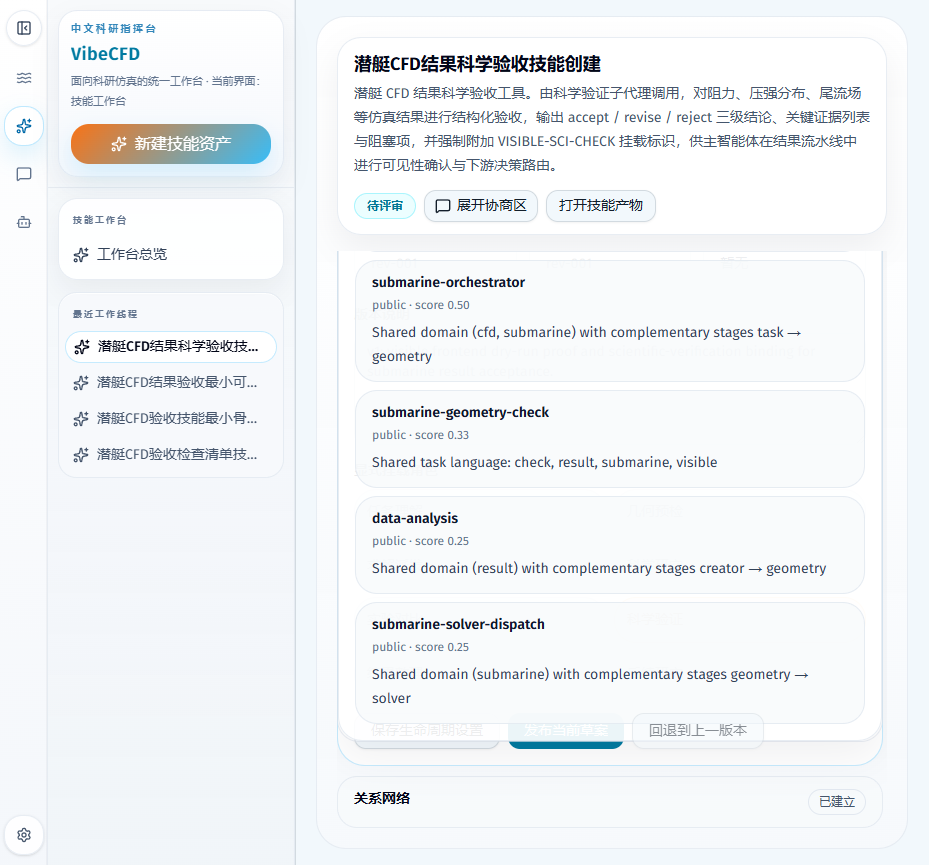

发布成功后，页面上应该能直接看到：

- `活动版本 = rev-001`
- `已发布版本 = rev-001`
- `版本数量 = 1`
- `绑定数量 = 1`
- 绑定目标里明确显示 `科学验证 -> submarine-result-acceptance-visible`

这一步代表技能已经不仅是线程里的草稿，而是正式进入项目可用状态。

## 6. 如何确认技能真的对运行中的智能体生效

这是当前版本最重要的“发布后证明”步骤。

### 6.1 新开一条潜艇线程

发布成功后，新开一条潜艇线程并发送任意一条正常的任务输入。系统会在该线程首次运行时捕获 **运行时技能快照**。

### 6.2 查看运行时技能快照

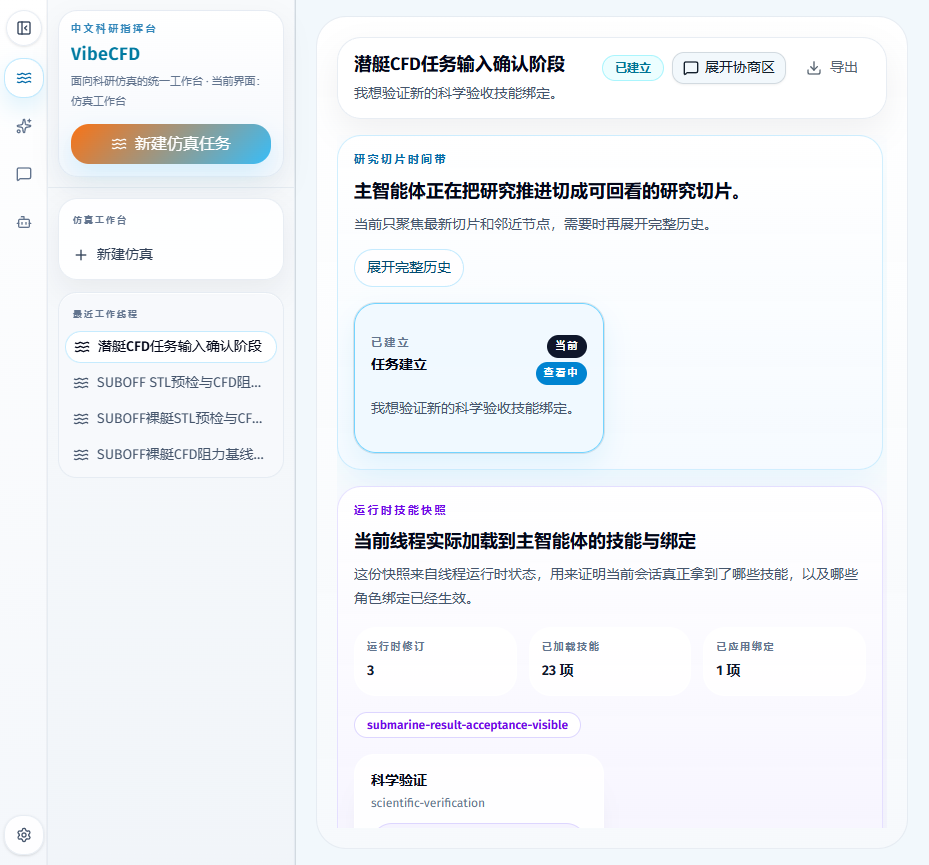

在主画布中，你现在可以直接看到：

- **运行时修订**
- **已加载技能**
- **已应用绑定**
- 具体角色和技能的映射关系

如果你刚才发布的是 `submarine-result-acceptance-visible`，并把它显式绑定到了 **科学验证**，那么这里应当直接出现：

- `科学验证`
- `scientific-verification`
- `submarine-result-acceptance-visible`

这一步的意义是：

- 证明技能不仅发布成功了
- 还证明新线程中的主智能体已经真正加载了它
- 用户只看前端也能完成确认，不需要去查后台状态或日志

## 7. 推荐的日常使用顺序

如果你的目标是“做一轮真实潜艇 CFD 并保留可追踪证据”，建议使用下面的顺序：

1. 在 **仿真工作台** 新建任务并上传 STL。
2. 在右侧协商区补齐工况、参考尺度和交付目标。
3. 在中央主画布点击 **可见下一步**，推进求解和结果整理。
4. 在 **对话** 页复查消息历史与文件产物。
5. 如果需要新的评审能力，再进入 **技能工作台** 创建或发布技能。
6. 发布后重新开一条新线程，在主画布的 **运行时技能快照** 中确认绑定已经生效。

## 8. 常见问题

### 8.1 我点了按钮，怎么确认不是后台偷偷执行的？

看右侧协商区的消息历史。当前版本的设计原则是：

- 中央主画布只负责把“下一步”讲清楚
- 真正的动作请求必须进入协商线程
- 线程历史里必须留下可追踪记录

### 8.2 技能保存生命周期设置时如果报错怎么办？

先检查三件事：

- 当前线程里是否已经生成 `skill-draft.json` 或 `skill-lifecycle.json`
- Gateway 是否正常运行在 `8001`
- 你是否已经在技能线程里真正拿到技能草案，而不是还停留在空白新建页

当前版本已经修复了“未发布草稿保存时直接 404”的问题。如果再次遇到，优先检查服务是否还是旧进程。

### 8.3 为什么旧潜艇线程里看不到新的运行时绑定？

运行时技能快照是在**线程运行时捕获**的。旧线程如果创建于技能发布之前，通常还保留旧快照。要验证新绑定是否生效，请新开一条线程。

### 8.4 哪些文件最值得优先看？

仿真任务里优先看：

- `cfd-design-brief.json`
- `solver-results.json`
- `final-report.md`
- `delivery-readiness.json`

技能任务里优先看：

- `skill-draft.json`
- `dry-run-evidence.json`
- `skill-lifecycle.json`
- `publish-readiness.json`
- `.skill` 打包文件

## 9. 当前版本的可交付结论

截至这份手册对应的版本，下面两条链路已经可以从前端直接完成验证：

1. 潜艇 CFD 可见链路

- 新建任务
- 输入需求
- 可见按钮推进执行或重跑
- 查看中间产物
- 生成最终报告

2. Skill Studio 可见链路

- 创建技能
- 试跑
- 保存生命周期
- 发布
- 在新线程中看到运行时绑定证明

如果你要继续扩展项目，推荐把这份手册和 `docs/superpowers/session-status/2026-04-12-frontend-visible-end-to-end-release-readiness-status.md` 一起作为当前版本的使用与验证基线。
